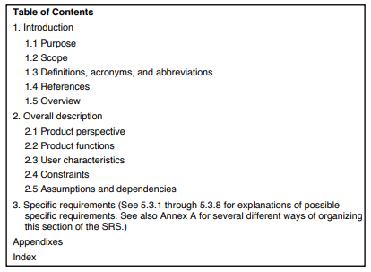

Que es un ERS?
==============

Según la wikipedia [-@wikipedia], la ERS es: "una descripción completa del
sistema que se va a desarrollar".

Según la @iee [p.3], la ERS es: "Una especificación para un producto de
software, programa, o grupo de programas que realiza ciertas funciones en un
ambiente especifico".

En mis propias palabras. La ERS es el documento que describe a detalle todos
los requisitos que se tienen para determinado software.

Cuales son las consideraciones para producir una buena ERS?
===========================================================

Según la @iee [p.3-10], hay cierta información que se tiene que tener presente
al momento de escribir una ERS. Esta incluye:

La naturaleza de la ERS
-----------------------

Las cuestiones que se tienen que tratar en la ERS son las siguientes:

* *Funcionalidad:* Que es lo que hará el software?
* *Interfaces externas:* Como es que el software va a interactuar con los
  usuarios? Con el hardware? Otro software?
* *Rendimiento:* A que velocidad tiene que correr? Cual debe ser su
  disponibilidad?
* *Atributos:* Como la portabilidad, seguridad, mantenibilidad, etc.
* *Restricciones:* Como limites en los recursos, el ambiente en el que operara,
  lenguaje en el que tiene que ser implementado, estándares existentes, etc.

El rol de la ERS
----------------

Como la ERS tiene un rol muy especifico, se tiene que tratar de mantenerla
dentro de ese rol. Esto significa que:

* Debería definir todos los requisitos del software.
* No debería describir ningún detalle de la implementación ni el diseño.
* No debería añadir ninguna restricción adicional al software.

Una buena ERS limita la cantidad de diseños validos, pero no especifica ninguno
de ellos.

Características de una buena ERS
--------------------------------

### Correcta

Una ERS es correcta si, y solo si, cada requisito establecido en ella es uno
que el software debe cumplir.

### Inequívoca

Una ERS es inequívoca si, y solo si, cada requisito establecido en ella tiene
una única interpretación.

En caso de que un termino pueda tener múltiples significados, este debería ser
incluido en un glosario donde se especifica una definición.

### Completa

Una ERS es completa si, y solo si, incluye los siguientes elementos:

* Todos los requisitos, ya sea que tengan que ver con la funcionalidad,
  rendimiento, restricciones, etc.
* Definiciones de las respuestas del software a todas las clases de datos de
  entrada en toda clase de situación.
* Todas las figuras, tablas y diagramas están etiquetados, y se definen todos
  los términos y unidades de medida.

### Consistente

Una ERS es consistente si, y solo si, los requisitos son consistentes entre si.

### Verificable

Una ERS es verificable si, y solo si, cada uno de los requisitos establecidos
en ella son verificables.

Un requisito es verificable si, y solo si, existe algún proceso rentable finito
con el que una persona o máquina puede verificar que el producto de software
cumple con el requisito.

### Modificable

Una ERS es modificable si, y solo si, su estructura y estilo están hechos de
una forma en la que cambios a los requisitos puedan hacerse de forma fácil.

### Trazable

Una ERS es trazable si el origen de cada uno de sus requisitos es claro
y facilita la referencia a cualquiera de los requisitos para un documento
futuro.

Evolución de la ERS
-------------------

Puede que la ERS tenga que evolucionar conforme el desarrollo del software
progrese. Esto ya que puede que sea imposible que se especifiquen todos los
detalles al inicio del desarrollo, o puede que tengan que hacerse cambios al
encontrarse con deficiencias o errores en la ERS original.

Gracias a esto, se tienen que tener en consideración 2 cosas:

1. Los requisitos tienen que especificarse de la forma mas completa que se
   pueda en su momento, incluso si futuras revisiones sean inevitables. En caso
   de estar incompletos, esto tiene que especificarse.
2. Un proceso formal tiene que iniciarse para identificar, controlar, reportar,
   y dar seguimiento a los cambios.

Cuales son las partes de una ERS?
=================================

Según la @iee [p.10-19], un outline a seguir al escribir una ERS es el
siguiente:

Aunque menciona que un buen ERS no necesariamente tiene que seguir el outline
al pie de la letra. Pero que si debería incluir toda la información presentada
aquí:

1 Introducción
---------------

Esta tiene que proveer un panorama general de todo el ERS. Contiene las
siguientes sub-secciones:

### 1.1 Propósito 

Aquí se especifica el propósito de el ERS, y también la audiencia objetivo.

### 1.2 Alcance

Esta sección tiene que:

1. Identificar los productos por nombre
2. Explicar que, y de ser necesario que no, harán los productos.
3. Describir la aplicación del producto, así como beneficios y metas.

### 1.3 Definiciones, acrónimos y abreviaciones

Tiene que dar toda la información necesaria para interpretar el ERS.

### 1.4 Referencias

Esta sección tiene que:

1. Dar una lista completa de todos los documentos a los que se hace referencia
   en otro lado en el ERS.
2. Identificar cada documento por: titulo, numero de reporte (si aplica),
   fecha, y organización.
3. Especificar las fuentes de donde se pudieron haber obtenido las referencias.

### 1.5 Visión General

Esta explica que es lo que contiene el resto del ERS y como esta organizado.

2 Descripción General
---------------------

Esta explica los factores generales que afectan al producto y sus requisitos.

**Nota:** Esta sección no da los requisitos específicamente, sino que da el
trasfondo a los mismos - que se definen en la sección 3 - y los hace mas
fáciles de entender.

### 2.1 Perspectiva del producto

Esta coloca el producto en perspectiva con otros productos relacionados. O si
el producto es independiente y completamente autónomo.

Este describe como el software opera con respecto a:

1. Interfaces de Sistema
2. Interfaz de usuario
3. Interfaces de hardware
4. Interfaces de Software
5. Interfaces de comunicación
6. Memoria
7. Operaciones
8. Requisitos de adaptabilidad del sistema

### 2.2 Funciones del producto

Esta contiene un resumen de las funciones mas grandes que tiene que tener el
software.

Estas tienen que estar organizadas de un modo que la lista de funciones sea
entendible para cualquier persona leyendo el documento por primera vez.

### 2.3 Características de Usuario

Estas describen las características generales del el usuario objetivo del
software. Incluye nivel educativo, experiencia, capacidad técnica, etc.

### 2.4 Limitaciones

Esta da una lista de cosas que van a limitar las opciones del desarrollador.
Incluye:

1. Políticas reguladoras
2. Limitaciones de Hardware
3. Interfaces a otras aplicaciones
4. Operaciones paralelas
5. Funciones para auditar
6. Funciones de control
7. "Requisitos de idioma de orden superior" (Traducción por Google, no se que
   es)
8. Protocolos de señales manuales
9. Requisitos de fiabilidad
10. Criticidad de la aplicación
11. Consideraciones de seguridad

### 2.5 Supuestos y dependencias

Por ejemplo, que el programa se utilizara en un sistema operativo especifico.

### 2.6 Prorrateo de los requisitos

Aquí se explican requisitos que puede que sean atrasados hasta futuras
versiones de el sistema.

3 Requisitos específicos
------------------------

Esta sección de el ERS tiene que contener todos los requisitos del software
a un nivel de detalle suficiente para que los diseñadores puedan diseñar el
sistema, y que los testers puedan hacer las pruebas para verificar que se
cumplen con los requisitos.

Esta suele ser la sección mas grande de el ERS.

### 3.1 Interfaces externas

Esta es una descripción detallada de todas las entradas y salidas de el
sistema. Esta tiene que complementar lo que se menciono en la **sección
2** sin repetir información.

### 3.2 Funciones

Aquí se definen las acciones fundamentales que tienen que tener lugar en el
software. Se describen los requisitos para las entradas, procesamiento
y generación de salidas.

Usualmente se escriben de la siguiente forma: "El sistema debería ..."

Estas incluyen:

1. Checkeos de la valides de las entradas.
2. Las secuencia exacta de las operaciones.
3. Respuestas a situaciones anormales.
4. Efecto de los parámetros.
5. Relacionen entre las entradas y las salidas.

### 3.3 Rendimiento

Aquí se tiene que especificar los requisitos numéricos en de el software. Por
ejemplo:

> *95% de las transacciones se tienen que realizar en menos de 1 segundo*

> *El sistema puede soportar hasta 2000 usuarios a la vez*

### 3.4 Limitaciones de diseño

Aquí se especifican las limitaciones que vengan de estándares, o de hardware.

### 3.5 Atributos de sistema

Aquí se enlistan los atributos que son requisitos como por ejemplo:

1. Seguridad
2. Potabilidad
3. Mantenibilidad

Conclusión
==========

Esta me parece una herramienta muy útil, y que puede ser practica en ciertos
casos. Pero también me parece que es muy rígida.

Ventajas
--------

Por su misma naturaleza, este deja muy poco espacio a errores y malentendidos
entre los desarrolladores, usuarios, y los clientes. Ademas, al tener toda la
información necesaria desde un principio, se puede planear de mejor manera como
se hará el desarrollo. Esto permite dar unas proyecciones mas exactas a los
clientes.

Desventajas
-----------

La creación de una ERS tiene un gran costo inicial. Se requiere de mucho tiempo
y esfuerzo para crear una de forma correcta. Esto puede no valer la pena para
proyectos que al final no se vayan a realizar.

Ademas, tengo entendido que el estándar en la industria es trabajar con
metodologías ágiles. Estas metodologías son abiertas al cambio. Y aunque se
supone que una buena ERS es modificable, en la practica dudo que sea la mejor
forma de gestionar esta clase de proyectos.

Bibliografías
=============

[**Link**](https://polo123456789.github.io/Universidad/FundamentosDeLaContruccionDeSoftware/Tareas/Unidad2/IEEE830.pdf)
al estándar citado.

