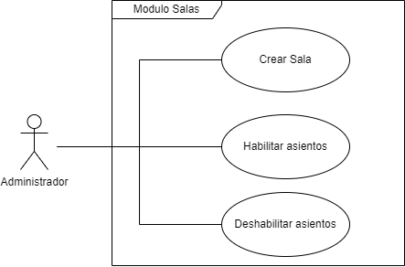
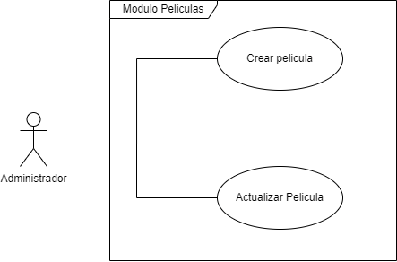
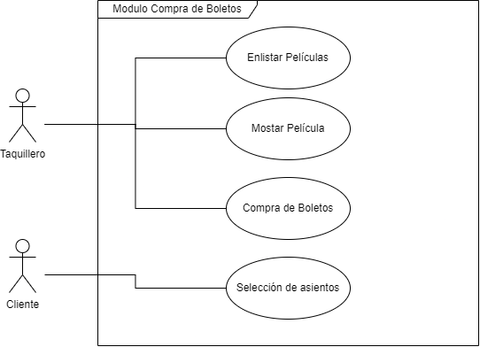

Introducción
============

Este documento es una Especificación de Requisitos de Software (ERS) del
sistema "Cine BlackSwan". Este contiene el resultado de la especificación de
los casos de uso del sistema. Este documento se ha hecho de acuerdo al estándar
"IEEE Recomended Practice for Software Requirements Specification IEEE Std.
830-1988".

Propósito
---------

El propósito de este documento es definir de manera clara y precisa las
funcionalidades y restricciones del sistema a construir.

Este documento va dirigido especialmente a el cliente y el equipo de
desarrollo, aunque puede ser de utilidad a cualquier persona a la que le sean
relevantes los requerimientos del sistema.

Ámbito del sistema
------------------

El futuro sistema se llamara "Cine BlackSwan". Este se encargara de gestionar
la venta de boletos y administración del cine.

Definiciones, Acrónimos y Abreviaturas
--------------------------------------

* **ERS:** Especificación de Requisitos del Software
* **LAN:** Red de área local. Es una red de computadoras que abarca un área
  reducida a una casa, un departamento o un edificio.

Referencias
-----------

* IEEE Recomended Practice for Software Requirements Specification IEEE Std.
  830-1988
* Clasificación de las películas, RTC, México.

Visión General del Documento
----------------------------

Este documento consta de tres secciones. Esta sección es la Introducción
y proporciona una visión general de la ERS. En la Sección 2 se da una
descripción general del sistema, con el fin de conocer las principales
funciones que debe realizar, los datos asociados y los factores, supuestos
y dependencias que afectan al desarrollo, sin entrar en excesivos detalles. En
la sección 3 se definen detalladamente los requisitos que debe satisfacer el
sistema.

Descripción General
===================

Esta sección provee una descripción a alto nivel del sistema.

Perspectiva del producto
------------------------

Este producto es independiente de otros productos.

Funciones del Producto
----------------------

### Catalogo de actores

* **Empleado:** Cualquier trabajador del cine "El cisne negro".
* **Taquillero:** Empleado que tiene como oficio vender los boletos.
* **Administrador:** Empleado encargado de la gestión del sistema.
* **Cliente:** Cualquier persona que vaya a utilizar los servicios que provee
  el cine "El cisne negro".

### Casos de uso por módulos

#### Modulo Usuarios

**Nota:** Al usarse "tablas administrativas" en esta sección, estas se refieren
a las tablas de:

* Usuarios
* Salas
* Películas
* Horarios

##### Editar perfil

El propósito de este caso es permitir a cada usuario modificar sus datos
personales (Dirección, Teléfono, Nombre de Usuario y Contraseña).

##### Crear en tablas administrativas

El propósito de este caso es permitir a los administradores crear entradas en
las tablas administrativas.

##### Leer en tablas administrativas

El propósito de este caso es permitir a los administradores leer entradas en
las tablas administrativas.

##### Actualizar en tablas administrativas

El propósito de este caso es permitir a los administradores actualizar entradas
en las tablas administrativas.
 
##### Borrar en tablas administrativas

El propósito de este caso es permitir a los administradores borrar entradas en
las tablas administrativas.

---

#### Modulo Salas

##### Crear Sala

Este caso es una extensión del caso descrito
[**aqui**](#crear-en-tablas-administrativas). El propósito de este caso es
permitir asignar una cantidad de filas, numero de asientos por fila, tipo de
sala y precios a los boletos a una respectiva sala.

##### Deshabilitar asientos

El propósito de este caso es, en una mapa de la sala, permitir deshabilitar
asientos previamente habilitados. Si un asiento es deshabilitado ya no podrá
ser seleccionado para la venta de boletos.

##### Habilitar asientos

El propósito de este caso es, en una mapa de la sala, permitir habilitar
asientos previamente deshabilitados.

---

#### Modulo Películas

##### Crear Película 

Este caso es una extensión del caso descrito
[**aqui**](#crear-en-tablas-administrativas). El propósito de este caso es
permitir asignar un titulo, duración, genero, clasificación, foto y formato
a una película.

##### Actualizar Película

Este caso es una extensión del caso descrito
[**aqui**](#actualizar-en-tablas-administrativas). El propósito de este caso es
permitir modificar el genero, clasificación y formato de una película.

---

#### Modulo Horarios

##### Asignar horario

Este caso es una extensión del caso descrito
[**aqui**](#crear-en-tablas-administrativas). El propósito de este caso es
permitir asignar un horario a una película.

---

#### Modulo Compra de Boletos

##### Enlistar Películas

El propósito de este caso es mostrarle al taquillero y al cliente las películas
disponibles.

##### Mostrar Película

El propósito de este caso es mostrarle al taquillero y al cliente los detalles
de la película seleccionada (Imagen, titulo, duración, genero, clasificación,
sala, horarios).

##### Compra de Boletos

El propósito de este caso es permitirle al taquillero procesar las compras de
los boletos de los clientes para la película que hayan seleccionado, en el
horario que hayan seleccionado.

##### Selección de asientos

El propósito de este caso es permitir a los clientes que ya hayan comprado sus
boletos seleccionar los asientos que quieran en la sala en la que verán la
película.

Características de los Usuarios
-------------------------------

El sistema deberá ofrecer una interfaz de usuario intuitiva, así que los
taquilleros y clientes tendrán que tener una mínima experiencia en el uso de
ordenadores para poder usarla.

Los administradores tienen que tener cierta experiencia en el uso de
ordenadores, y tienen que tener experiencia en el uso de programas de hojas de
calculo (ej. Excel).

Restricciones
-------------

El gestor de bases de datos tiene que ser `SQL Server 2014`.

Supuestos y Dependencias
------------------------

### Supuestos

Se asume que los requisitos descritos en este documento son estables una vez
aprobados. Cualquier petición de cambios en la especificación deben ser
aprobadas por todas las partes.

### Dependencias

El sistema es independiente de otros, requiriendo únicamente una LAN para
comunicar los ordenadores adentro del cine.

Requisitos Específicos
======================

Esta sección contiene a nivel detallado la funcionalidad y restricciones del
sistema.

Interfaces Externas
-------------------

La interfaz de usuario tiene que ser intuitiva y fácil de aprender.

El gestor de bases de datos tendrá que correr en un servidor, que se conectara
a los demás ordenadores mediante una LAN.

Funciones
---------

Estas se ordenaran de acuerdo a los casos de uso descritos en la [**Seccion
2.2**](#funciones-del-producto) para simplificar la comprensión del documento.

### Especificación del Modulo Usuarios

#### Especificación de Editar Perfil

##### Flujo de trabajo

1. El empleado selecciona la opción de editar perfil.
2. Se muestran al usuario cajas de texto editables (cada una con una etiqueta
   que la identifique) con los datos:

    * Dirección
    * Teléfono
    * Nombre de usuario
    
   Un botón que diga "Actualizar", y otro que diga "Cambiar Contraseña".
3. Se permite que el empleado edite los campos de texto.

**Si el usuario presiona el botón "Actualizar":**

4. Se verifican las post condiciones, informando al usuario en caso de que
   alguna falle.
5. De haber pasado las post condiciones, se guardan los cambios en la base de
   datos.

**Si el usuario presiona el botón "Cambiar Contraseña":**

4. Se abre otra ventana donde hay dos cajas de texto vacías, y un botón que
   diga "Actualizar".
5. Se le solicita al empleado que ingrese su nueva contraseña en ambas cajas de
   texto.
6. Al presionar el botón, si ambas contraseñas son iguales la contraseña se
   actualiza. De lo contrario se solicita al empleado que la vuelva a ingresar.

##### Requerimientos especiales

No existen requerimientos especiales para este caso de uso.

##### Pre condiciones

No existen pre condiciones para este caso de uso.

##### Post condiciones

En caso de que el usuario cambie los datos en las cajas de texto, se verificara
que:

1. El numero de teléfono siga el formato: `XXXX-XXXX`, donde cada `X`
   representa un dígito del `0` al `9`.
2. Que no exista en la base de datos otro usuario con el mismo nombre de
   usuario.

---

#### Especificación de Crear en tablas administrativas

##### Flujo de trabajo

1. El administrador seleccionara una de las tablas administrativas.
2. Se enlistaran los campos de respectiva tabla, permitiendo al administrador
   ingresar los datos.
3. Se le dará la opción al administrador de guardar los datos.
4. De aceptar, los datos se guardaran en la base de datos.

##### Requerimientos especiales

No existen requerimientos especiales para este caso de uso.

##### Pre condiciones

No existen pre condiciones para este caso de uso.

##### Post condiciones

Se verificara que los datos ingresados cumplan con las restricciones de los
tipos de datos que coloque el gestor de bases de datos.

---

#### Especificación de Leer en tablas administrativas

##### Flujo de trabajo

1. El administrador seleccionara una de las tablas administrativas.
2. El sistema mostrara las entradas que se encuentren en esa tabla

##### Requerimientos especiales

No existen requerimientos especiales para este caso de uso.

##### Pre condiciones

La tabla tiene que tener como mínimo 1 entrada.

##### Post condiciones

No existen post condiciones para este caso de uso.

---

#### Especificación de Actualizar en tablas administrativas

##### Flujo de trabajo

1. El administrador seleccionara una de las tablas administrativas.
2. El sistema mostrara las entradas que se encuentren en esa tabla, permitiendo
   que el administrador escoja una de ellas.
3. Al escoger una de ellas, el sistema mostrara los datos de la entrada en
   cajas de texto editables, permitiendo al administrador modificarlos.
4. Se le da la opción al administrador de guardar los cambios
5. De aceptar, los datos se guardaran en la base de datos.

##### Requerimientos especiales

No existen requerimientos especiales para este caso de uso.

##### Pre condiciones

La tabla tiene que tener como mínimo 1 entrada.

##### Post condiciones

Se verificara que los datos ingresados cumplan con las restricciones de los
tipos de datos que coloque el gestor de bases de datos.

---

#### Especificación de Borrar en tablas administrativas

##### Flujo de trabajo

1. El administrador seleccionara una de las tablas administrativas.
2. El sistema mostrara las entradas que se encuentren en esa tabla, permitiendo
   que el administrador escoja una de ellas.
3. Al escoger una de ellas, el sistema mostrara los datos de la entrada, y le
   dará la opción al administrador de eliminar la entrada.
4. De aceptar la opción de eliminar la entrada, se abrirá una ventana emergente
   solicitándole al administrador que confirme que quiere eliminar la entrada,
   informándole que esta acción no se puede deshacer.
5. De aceptar el administrador, la entrada se borrara de la base de datos.

##### Requerimientos especiales

No existen requerimientos especiales para este caso de uso.

##### Pre condiciones

La tabla tiene que tener como mínimo 1 entrada.

##### Post condiciones

No existen post condiciones para este caso de uso.

### Especificación Modulo Salas

#### Especificación de Crear Sala

##### Flujo de trabajo

1. Se le mostrara al administrador:

    * Una etiqueta indicando el numero de sala generado automáticamente.
    * Una caja de texto para ingresar la cantidad de filas.
    * Una caja de texto para ingresar la cantidad de asientos por fila.
    * Dos botones radio. Uno que diga `3D`, y otro que diga `2D`.
    * Una caja de texto para ingresar el precio de boleto de adulto.
    * Una caja de texto para ingresar el precio de boleto de niño.
    * Una caja de texto para ingresar el precio de boleto de tercera edad.

   Y el sistema esperara a que rellene los datos.
2. Abajo de las cajas de texto, se generara un mapa de la sala en el que se
   mostraran todos los asientos.
3. Opcionalmente se podrá entrar en los casos: "Deshabilitar asientos"
   y "Habilitar asientos".
4. Se le dará la opción de guardar al administrador.
5. De aceptar, se guardara la sala en la base de datos

##### Requerimientos especiales

No existen requerimientos especiales para este caso de uso.

##### Pre condiciones

No existen pre condiciones para este caso de uso.

##### Post condiciones

No existen post condiciones para este caso de uso.

---

#### Especificación de Deshabilitar asientos

##### Flujo de trabajo

1. En el mapa de la sala, el administrador podrá hacer clics a cualquier
   asiento habilitado, deshabilitandolo.

##### Requerimientos especiales

A este caso de uso se puede llegar únicamente desde el caso "Crear Sala".

##### Pre condiciones

No existen pre condiciones para este caso de uso.

##### Post condiciones

No existen post condiciones para este caso de uso.

---

#### Especificación de Habilitar asientos

##### Flujo de trabajo

1. En el mapa de la sala, el administrador podrá hacer clics a cualquier
   asiento deshabilitado, habilitandolo.

##### Requerimientos especiales

A este caso de uso se puede llegar únicamente desde el caso "Crear Sala".

##### Pre condiciones

No existen pre condiciones para este caso de uso.

##### Post condiciones

No existen post condiciones para este caso de uso.

### Especificación Modulo Películas

#### Especificación de Crear Película

##### Flujo de trabajo

1. Se le mostrara al administrador:
    
    * Una caja de texto para ingresar el titulo.
    * Una caja de texto para ingresar la duración.
    * Una caja de texto para ingresar el genero.
    * Una caja de texto para ingresar la clasificación.
    * Una caja de texto para ingresar la ubicación de la foto.
    * Dos botones radio. Uno que diga `3D`, y otro que diga `2D`.

   Y el sistema esperara a que rellene los datos.
2. Se verificaran las entradas, y se le dará la opción al administrador de
   guardar la película.
3. De aceptar, se guardara la película en la base de datos.

##### Requerimientos especiales

No existen requerimientos especiales para este caso de uso.

##### Pre condiciones

No existen pre condiciones para este caso de uso.

##### Post condiciones

Se verificara que los datos ingresados cumplan con las restricciones de los
tipos de datos que coloque el gestor de bases de datos.

Se verificara que la ubicación de la foto sea valida, y que contenga una foto.

Se verificara que la clasificación sea un elemento de la siguiente lista:

* AA
* A
* B
* B15
* C
* D

---

#### Especificación de Actualizar Película

##### Flujo de trabajo

1. Se mostrara al administrador la lista de películas disponibles,
   permitiendole seleccionar una.
2. Al seleccionar una, se mostrara:

    * Una caja de texto editable con el genero de la película.
    * Una caja de texto editable con la clasificación de la película.
    * Una caja de texto editable con el formato de la película.

   Y se le permitirá editar los datos.
3. Se le dará la opción al administrador de guardar los cambios.
4. De aceptar, se guardaran los datos.

##### Requerimientos especiales

No existen requerimientos especiales para este caso de uso.

##### Pre condiciones

Tiene que existir al menos una película para ser editada.

##### Post condiciones

Se verificara que los datos ingresados cumplan con las restricciones de los
tipos de datos que coloque el gestor de bases de datos.

Se verificara que la clasificación sea un elemento de la siguiente lista:

* AA
* A
* B
* B15
* C
* D

### Especificación Modulo Horarios

#### Especificación de Asignar Horario

##### Flujo de trabajo

1. Se le mostrara al administrador:

    * Una caja de texto para que ingrese el numero de sala.
    * Una caja de lista donde estarán las películas disponibles.
    * Una caja de texto donde ingresara la hora de inicio en formato 24 horas.

   Y se le permitirá que ingrese los datos.
2. Al ingresarse los datos, se mostrara:
    
    * Una etiqueta indicando la hora de finalización de la película (Hora de
      inicio + duración + 20 minutos para la limpieza).

    Y se le dará la opción al administrador de guardar.
3. De aceptar, se guarda el horario en la base de datos.

##### Requerimientos especiales

No existen requerimientos especiales para este caso de uso.

##### Pre condiciones

Tiene que existir al menos una película y una sala.

##### Post condiciones

Se verificara que el numero de sala sea valido.

Se verificara que la hora de inicio y finalización estén dentro del horario del
cine.

Se verificara que el horario en el que se pasara la película no este en
conflicto con otro horario en la misma sala.

### Especificación Modulo Compra de Boletos

#### Especificación de Enlistar Películas

##### Flujo de trabajo

1. Se le mostraran al taquillero y al cliente las películas que estén
   disponibles, permitiendole al cliente elegir una de ellas.
2. De seleccionar una, entrarían en el caso "Mostrar Película".

##### Requerimientos especiales

No existen requerimientos especiales para este caso de uso.

##### Pre condiciones

No existen pre condiciones para este caso de uso.

##### Post condiciones

No existen post condiciones para este caso de uso.

---

#### Especificación de Mostrar Película

##### Flujo de trabajo

1. El sistema mostrara:

    * La imagen de portada de la película.
    * Una etiqueta con el titulo de la película
    * Una etiqueta con la duración de la película.
    * Una etiqueta con el genero de la película.
    * Una etiqueta con la duración de la película.
    * La sala en la que se exhibe la película.
    * Una caja de lista con los horarios en los que se esta reproduciendo la
      película.

   Y se le permitirá al cliente elegir el horario en el que quiere ver la
   película.
2. De elegir un horario, se entra en el caso "Compra de Boletos".

##### Requerimientos especiales

No existen requerimientos especiales para este caso de uso.

##### Pre condiciones

No existen pre condiciones para este caso de uso.

##### Post condiciones

No existen post condiciones para este caso de uso.

---

#### Especificación de Compra de boletos

##### Flujo de trabajo

1. El sistema mostrara al taquillero:
    
    * Una caja de texto para ingresar el nombre y los apellidos del cliente
    * 3 cajas de texto, para ingresar la cantidad de boletos de adulto, niño
      y tercera edad respectivamente.

   Ademas, el sistema mostrara al cliente:

    * 3 etiquetas, para mostrar los precios de los boletos de adulto, niño
      y tercera edad respectivamente.

    Y esperara a que el taquillero ingrese los datos.
2. Se le mostrara al cliente los sub-totales, y el total, dando la opción
   a comprar.
3. De aceptar, se verificara que hay suficientes asientos en la sala, y de ser
   este el caso se pasara al caso "Selección de asientos".

##### Requerimientos especiales

No existen requerimientos especiales para este caso de uso.

##### Pre condiciones

No existen pre condiciones para este caso de uso.

##### Post condiciones

No existen post condiciones para este caso de uso.

---

#### Especificación de Selección de asientos

##### Flujo de trabajo

1. El sistema mostrara al cliente un mapa de la sala, en la que los asientos
   libres, ocupados y deshabilitados se verán de distinta manera. También
   mostrara la distinción entre los 3 tipos de asientos, permitiendole al
   cliente elegir tantos asientos libres como boletos haya comprado.
2. Una vez haya seleccionado tantos asientos como boletos haya comprado, se le
   solicitara que confirme que esos son los asientos que desea.
3. De aceptar, se marcaran los asientos como ocupados, y se le darán los
   boletos al cliente.

##### Requerimientos especiales

No existen requerimientos especiales para este caso de uso.

##### Pre condiciones

No existen pre condiciones para este caso de uso.

##### Post condiciones

No existen post condiciones para este caso de uso.

Requisitos de rendimiento
-------------------------

El sistema debe poder soportar al menos el doble de usuarios como taquilleros
hay en el cine.

Todas las operaciones en las que hay un cliente involucrado deben tomar menos de
1 segundo.

Restricciones de Diseño
-----------------------

El gestor de bases de datos tiene que ser `SQL Server 2014`.

Atributos del Sistema
---------------------

### Fiabilidad

El sistema tiene que estar en linea 100% del tiempo.

### Portabilidad

El sistema tiene que ser una aplicación de escritorio para Windows.

### Seguridad

Previo a tomar cualquier acción, el sistema le solicitara a los empleados que
inicien sesión.

Las contraseñas no deben guardarse en texto plano. Estas pasaran por un
algoritmo hash (`SHA-256`), y los hashes serán guardados en la base de datos.

Otros requisitos
----------------

### Datos a guardar de los empleados

* DPI
* Nombre
* Apellido
* Dirección
* Teléfono
* Nombre de usuario
* Rol
* Contraseña (En hash).

Apéndices
=========

Referencias
-----------

Ademas del documento que nos dio que resumía la estructura de una ERS, utilice
[**esta tarea que entregue en el curso de Fundamentos de Contruccion de
Software**](https://polo123456789.github.io/Universidad/FundamentosDeLaContruccionDeSoftware/Tareas/Unidad2/actividad3-ers.pdf),
[**este ejemplo que encontre en
studocu**](https://www.studocu.com/en-us/document/pontificia-universidad-catolica-del-peru/sistemas-de-informacion-2/especificacion-de-requisitos-de-software-ers-ejemplo/3558403/download/especificacion-de-requisitos-de-software-ers-ejemplo.pdf),
[**y este ejemplo que encontre en
silo.tips**](https://silo.tips/download/ers-ejemplo-proceso-de-desarrollo-empresa).

Modelo de desarrollo
--------------------

Creo que el mejor modelo en este caso es el que conocemos como el ciclo de vida
clásico del software, el modelo en cascada. Este no suele ser el mejor en
muchos de los casos, pero considero que en este si lo es ya que los
requerimientos están completamente definidos desde un principio, lo que hace
que este modelo sea el mas sencillo a seguir.
