Diagramas de casos de uso
=========================

Modulo Usuarios
---------------

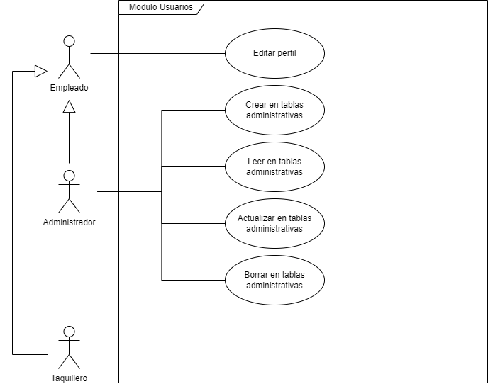

Modulo Salas
------------

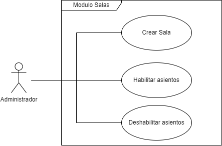

Modulo Películas
----------------

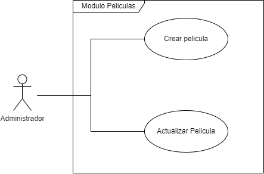

Modulo Horarios
---------------

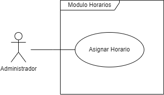

Modulo Compra de Boletos
------------------------

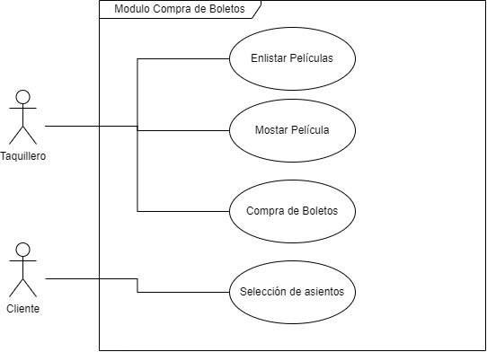

Diagramas de transición de estados
==================================

Modulo Usuarios
---------------

### Editar Perfil

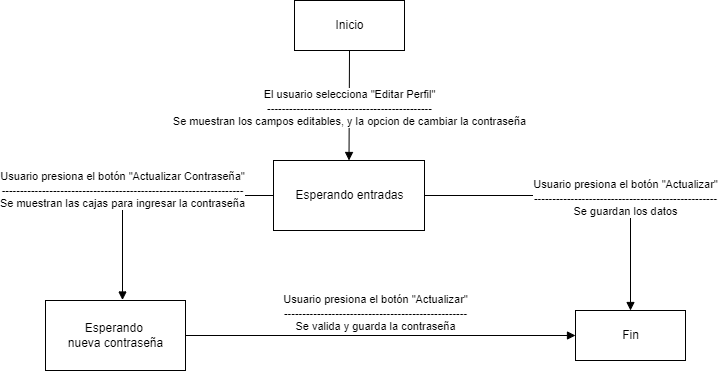

### Crear en tablas Administrativas

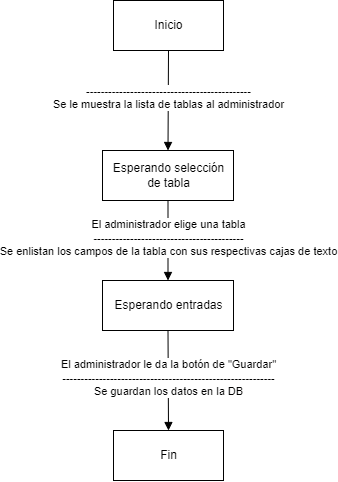

### Leer en tablas Administrativas

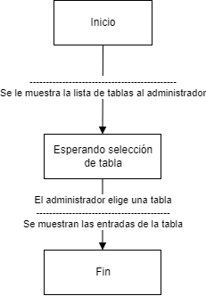

### Actualizar en tablas administrativas

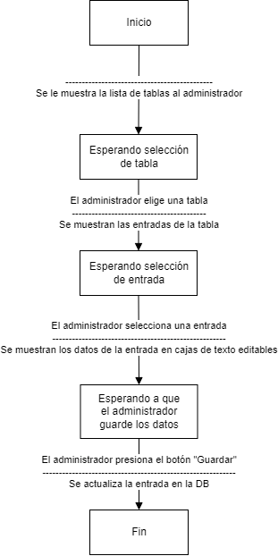

### Borrar en tablas administrativas

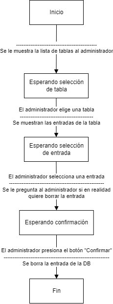

Modulo Salas
------------

### Crear Sala / Habilitar Asientos / Deshabilitar Asientos

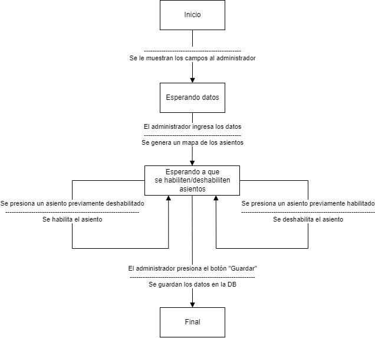

Modulo Películas
----------------

### Crear Película

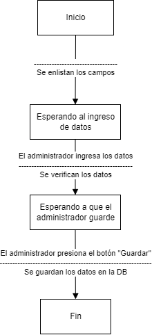

### Actualizar Película

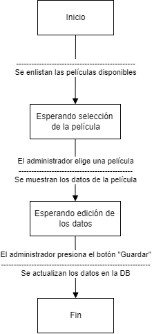

Modulo Horarios
---------------

### Asignar Horario

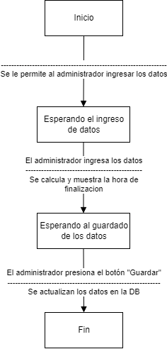

Modulo Compra de Boletos
------------------------

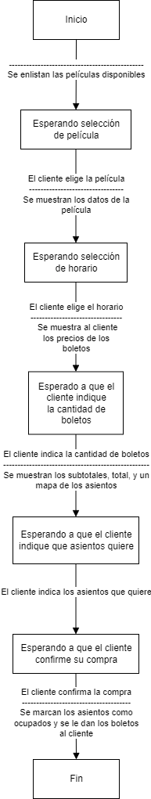
