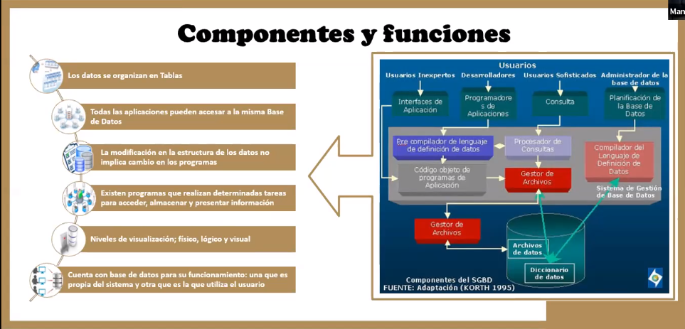

Sistema de gestión de bases de datos (SGBD)
===========================================

Características
---------------

* Hace menos compleja la administración de la información
* Minimiza la redundancia de datos
* Mantiene la consistencia de los datos
* El desarrollo de programas y su mantenimiento se reduce
* Flexibilidad de acceso a los datos
* Provee mecanismos automáticos para verlo por los accesos a los datos

Aplicaciones
------------

MySQL sera el gestor que utilizaremos en este curso.

Componentes y funciones
-----------------------

Clasificación
-------------

### Criterios de uso

Según el modelo:

* Jerárquico
* De red
* Relacional
* Orientado a objetos

Según el numero de usuarios:

* Mono usuario
* Multi usuario

Según el acceso:

* Centralizado
* Distribuido

Según el ámbito de aplicación:

* De propósito general
* De propósito especifico

Bases de datos
==============

Características
---------------

* Independencia lógica y física de los datos
* Redundancia mínima
* Acceso concurrente por parte de múltiples usuarios
* Mantiene la integridad de los datos
* Consultas complejas optimizadas
* Seguridad de acceso y auditoria
* Respaldo y recuperación
* Acceso a través de lenguajes de programación estándar

Lenguajes especiales
--------------------

Para comunicar la base de datos con el gestor se requieren de lenguajes
especiales.

* DDL: Lenguaje de definición de datos (Data Definition Language). Ex: `Create
  Table`, `Alter table`, `Drop Table`, etc.
* DML: Lenguaje de manipulación de datos (Data Manipulación Language). EX:
  `Insert`, `Update`, `Delete`, `Select`.
* SQL: Lenguaje estructurado de consulta (Structured Query Language). La unión
  de ambos lenguajes.

Estructura
----------

Son los tipos de datos, los vinculos o relaciones, y las restricciones que
deben cumplir esos datos.

* Integridad
* Duplicidad
* Atomicidad
