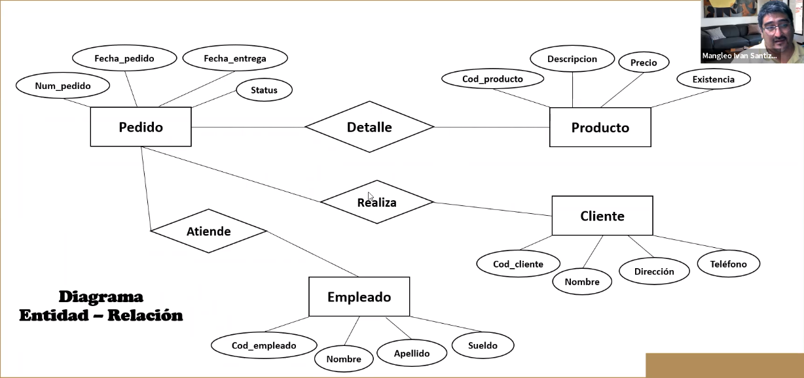
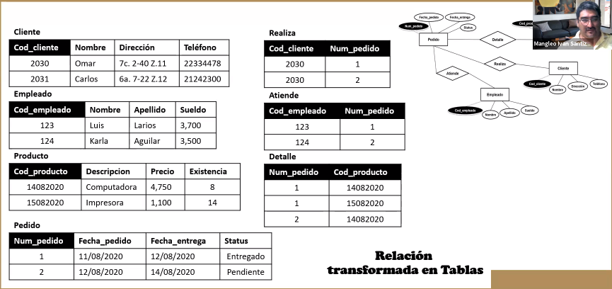
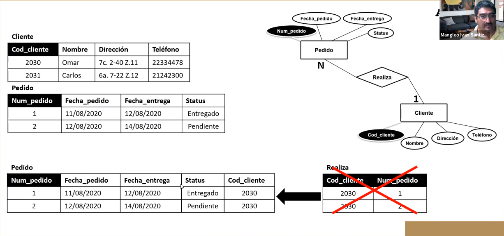
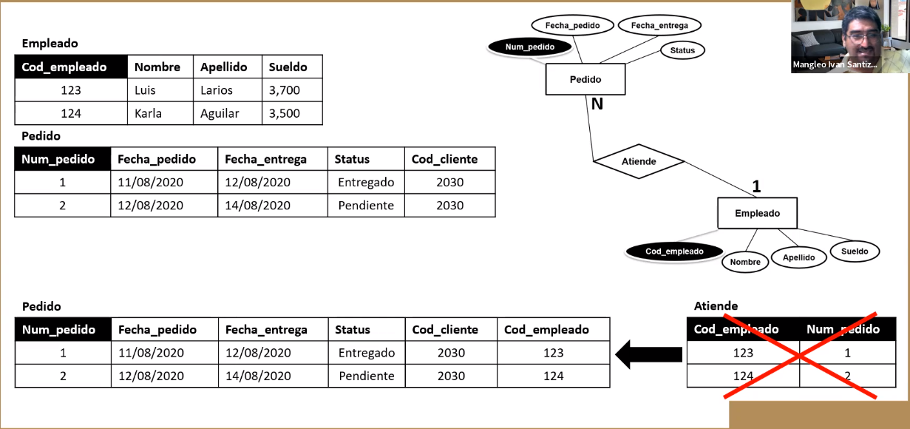
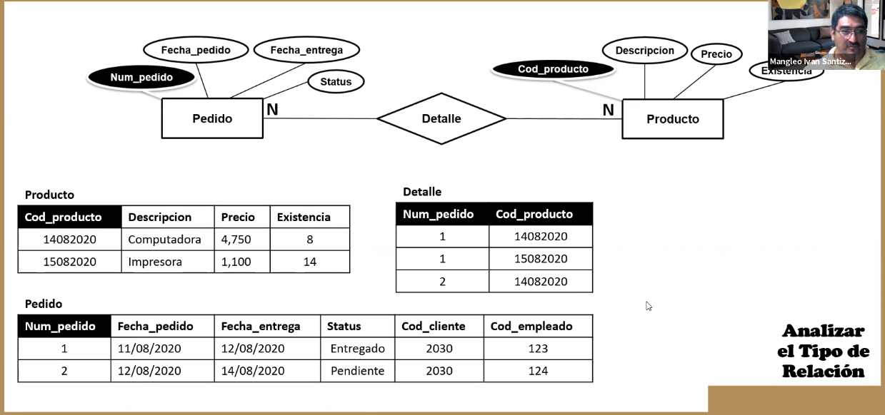
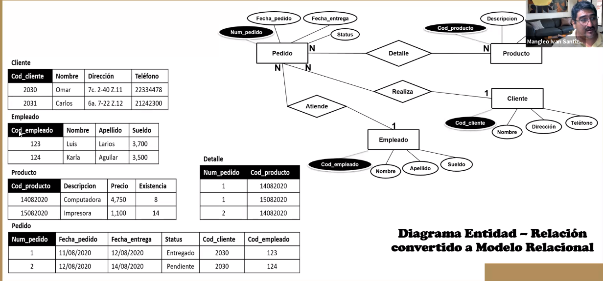

Diagrama Entidad-Relación
=========================

* Se comienza con un modelo ER porque es mas fácil de diseñar.
* Tiene 2 conceptos: Entidad ($\Box$) y Relación ($\diamond$).

Para traducir el diagrama ER a modelo relacional:

1. Cada entidad se transforma en una tabla con los mismos atributos
2. Se crean claves para todas las entidades
3. Cada relación se transforma en una tabla, donde sus atributos son las claves
   de las entidades participantes en dicha relación.

Ejemplo
-------

Una base de datos guarda ciertos pedidos, que son de ciertos productos. Estos
son realizados por clientes, y se tiene que llevar el registro de el empleado
que llevo la operación.

Relación transformada a tablas
==============================

Análisis del tipo de relación
-----------------------------

Cuando tenemos una relación $1$ a $*$, podemos anular la entidad creada (la
tabla `Realiza` en el ejemplo).

Si la relación es de muchos a muchos, mantenemos la entidad creada (la tabla
`Detalle` en el ejemplo).

Entonces nuestro diagrama ER paso a ser el siguiente modelo:

