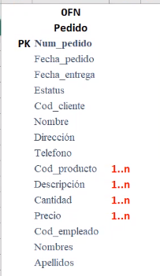
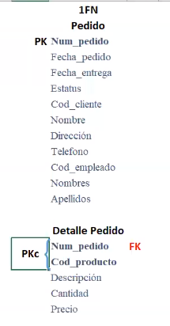
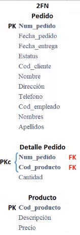
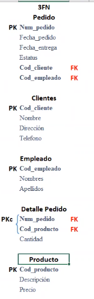

La **Normalización** consiste en diseñar las tablas que almacenan la
información necesaria, de tal forma que se minimice la redundancia de datos
y garantice su consistencia. Consta de 4 etapas que son denominadas formas
normales.

0FN
===

Es la forma original:

* Se enlistan todas las propiedades.
* Se identifica la entidad.
* Se define la llave primaria.
* Se identifican las propiedades que tengan mas de una ocurrencia. (Marcadas
  con un $(1...n)$).

1FN
===

No deben existir propiedades con varias ocurrencias.

* Se crea una nueva entidad
* Se copia la llave primaria de la entidad origen a la nueva entidad (Como una
  llave foránea `FK`).
* Todas las propiedades con mas de una ocurrencia de la entidad origen se
  mueven a la nueva entidad.
* Se define una llave primaria compuesta (`PK`). Esta deberá tener la llave
  primaria de la entidad origen (`FK`) y las propiedades que permitan
  identificar de forma única a la nueva entidad.

2FN
===

Tiene que encontrarse en 1FN y no deben existir propiedades que NO dependan de
la llave primaria compuesta.

* Todas las propiedades que no dependan de la llave primaria compuesta deben
  moverse a una nueva entidad.
* Se identifican la nueva entidad y se establece su llave primaria.
* Esta se aplica únicamente a las entidades que tengan una llave primaria
  compuesta.

3FN
===

Tiene que encontrarse en 2FN y todas las propiedades deben depender únicamente
de la llave primaria simple.

* Todas las propiedades que no dependan de la llave primaria simple deben
  moverse a una nueva entidad.
* Se identifica la nueva entidad y se le asigna su llave primaria
* Este se aplica únicamente a las entidades con una llave primaria simple.

