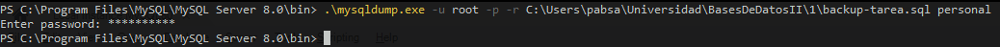

# Script de la Base de datos

```sql
-- crea la base de datos con el nombre “Personal’.
CREATE DATABASE	personal;
USE personal;

CREATE TABLE nacionalidad (
    idnacionalidad int PRIMARY KEY NOT NULL,
    pais varchar(45)
);

CREATE TABLE persona (
    idpersona int PRIMARY KEY NOT NULL,
    nombre varchar(45),
    apellido varchar(45),
    correo varchar(45)
);

CREATE TABLE control (
    idcontrol int PRIMARY KEY NOT NULL,
    idpersona int NOT NULL,
    idnacionalidad int NOT NULL,
    fecha DATE,
    
    INDEX(idpersona),
    FOREIGN KEY (idpersona) REFERENCES persona(idpersona),
    INDEX(idnacionalidad),
    FOREIGN KEY (idnacionalidad) REFERENCES nacionalidad(idnacionalidad)
);

-- Ingrese 5 registros en cada una de las tablas.

INSERT INTO nacionalidad VALUES
    (1, 'Guatemala'),
    (2, 'Mexico'),
    (3, 'El Salvador'),
    (4, 'Belice'),
    (5, 'Honduras');
    
INSERT INTO persona VALUES
    (1, 'Pablo', 'Sanchez', 'PabloSanchez@gmail.com'),
    (2, 'Marcos', 'Sanchez', 'MarcosSanchez@gmail.com'),
    (3, 'Pedro', 'Perez', 'PedroPerez@gmail.com'),
    (4, 'Juan', 'Martinez', 'JuanMartinez@gmail.com'),
    (5, 'Carlos', 'Perez', 'CarlosPerez@gmail.com');

INSERT INTO control VALUES
    (1, 1, 1, CURDATE()),
    (2, 2, 2, CURDATE()),
    (3, 3, 3, CURDATE()),
    (4, 4, 4, CURDATE()),
    (5, 5, 5, CURDATE());
    
-- Cree un usuario llamado ‘sam’ con los siguientes privilegios:
-- 	* Acceso únicamente para consultar (personal.*) las tablas de la base de datos “Personal”.
-- 	* El acceso únicamente debe ser local (localhost).

CREATE USER 'sam'@'localhost' IDENTIFIED BY 'galileo';
GRANT SELECT ON personal.* TO 'sam'@'localhost';

-- Cree un usuario llamado ‘Andy’ con los siguientes privilegios:
-- 	* Que pueda ejecutar: select, insert, update, delete, create, alter (personal.*)
-- 	* El acceso es permitido desde cualquier computadora.

CREATE USER 'Andy'@'%' IDENTIFIED BY 'galileo';
GRANT SELECT, INSERT, UPDATE, DELETE, CREATE, ALTER ON personal.* TO 'Andy'@'%';

-- Limpieza

DROP USER 'sam'@'localhost';
DROP USER 'Andy'@'%';
DROP DATABASE personal;
```

# Prueba de el backup

Esta es la captura de el cmd:



Y este es el dump:

```sql
-- MySQL dump 10.13  Distrib 8.0.26, for Win64 (x86_64)
--
-- Host: localhost    Database: personal
-- ------------------------------------------------------
-- Server version	8.0.26

/*!40101 SET @OLD_CHARACTER_SET_CLIENT=@@CHARACTER_SET_CLIENT */;
/*!40101 SET @OLD_CHARACTER_SET_RESULTS=@@CHARACTER_SET_RESULTS */;
/*!40101 SET @OLD_COLLATION_CONNECTION=@@COLLATION_CONNECTION */;
/*!50503 SET NAMES utf8mb4 */;
/*!40103 SET @OLD_TIME_ZONE=@@TIME_ZONE */;
/*!40103 SET TIME_ZONE='+00:00' */;
/*!40014 SET @OLD_UNIQUE_CHECKS=@@UNIQUE_CHECKS, UNIQUE_CHECKS=0 */;
/*!40014 SET @OLD_FOREIGN_KEY_CHECKS=@@FOREIGN_KEY_CHECKS, FOREIGN_KEY_CHECKS=0 */;
/*!40101 SET @OLD_SQL_MODE=@@SQL_MODE, SQL_MODE='NO_AUTO_VALUE_ON_ZERO' */;
/*!40111 SET @OLD_SQL_NOTES=@@SQL_NOTES, SQL_NOTES=0 */;

--
-- Table structure for table `control`
--

DROP TABLE IF EXISTS `control`;
/*!40101 SET @saved_cs_client     = @@character_set_client */;
/*!50503 SET character_set_client = utf8mb4 */;
CREATE TABLE `control` (
  `idcontrol` int NOT NULL,
  `idpersona` int NOT NULL,
  `idnacionalidad` int NOT NULL,
  `fecha` date DEFAULT NULL,
  PRIMARY KEY (`idcontrol`),
  KEY `idpersona` (`idpersona`),
  KEY `idnacionalidad` (`idnacionalidad`),
  CONSTRAINT `control_ibfk_1` FOREIGN KEY (`idpersona`) REFERENCES `persona` (`idpersona`),
  CONSTRAINT `control_ibfk_2` FOREIGN KEY (`idnacionalidad`) REFERENCES `nacionalidad` (`idnacionalidad`)
) ENGINE=InnoDB DEFAULT CHARSET=utf8mb4 COLLATE=utf8mb4_0900_ai_ci;
/*!40101 SET character_set_client = @saved_cs_client */;

--
-- Dumping data for table `control`
--

LOCK TABLES `control` WRITE;
/*!40000 ALTER TABLE `control` DISABLE KEYS */;
INSERT INTO `control` VALUES (1,1,1,'2021-10-30'),(2,2,2,'2021-10-30'),(3,3,3,'2021-10-30'),(4,4,4,'2021-10-30'),(5,5,5,'2021-10-30');
/*!40000 ALTER TABLE `control` ENABLE KEYS */;
UNLOCK TABLES;

--
-- Table structure for table `nacionalidad`
--

DROP TABLE IF EXISTS `nacionalidad`;
/*!40101 SET @saved_cs_client     = @@character_set_client */;
/*!50503 SET character_set_client = utf8mb4 */;
CREATE TABLE `nacionalidad` (
  `idnacionalidad` int NOT NULL,
  `pais` varchar(45) DEFAULT NULL,
  PRIMARY KEY (`idnacionalidad`)
) ENGINE=InnoDB DEFAULT CHARSET=utf8mb4 COLLATE=utf8mb4_0900_ai_ci;
/*!40101 SET character_set_client = @saved_cs_client */;

--
-- Dumping data for table `nacionalidad`
--

LOCK TABLES `nacionalidad` WRITE;
/*!40000 ALTER TABLE `nacionalidad` DISABLE KEYS */;
INSERT INTO `nacionalidad` VALUES (1,'Guatemala'),(2,'Mexico'),(3,'El Salvador'),(4,'Belice'),(5,'Honduras');
/*!40000 ALTER TABLE `nacionalidad` ENABLE KEYS */;
UNLOCK TABLES;

--
-- Table structure for table `persona`
--

DROP TABLE IF EXISTS `persona`;
/*!40101 SET @saved_cs_client     = @@character_set_client */;
/*!50503 SET character_set_client = utf8mb4 */;
CREATE TABLE `persona` (
  `idpersona` int NOT NULL,
  `nombre` varchar(45) DEFAULT NULL,
  `apellido` varchar(45) DEFAULT NULL,
  `correo` varchar(45) DEFAULT NULL,
  PRIMARY KEY (`idpersona`)
) ENGINE=InnoDB DEFAULT CHARSET=utf8mb4 COLLATE=utf8mb4_0900_ai_ci;
/*!40101 SET character_set_client = @saved_cs_client */;

--
-- Dumping data for table `persona`
--

LOCK TABLES `persona` WRITE;
/*!40000 ALTER TABLE `persona` DISABLE KEYS */;
INSERT INTO `persona` VALUES (1,'Pablo','Sanchez','PabloSanchez@gmail.com'),(2,'Marcos','Sanchez','MarcosSanchez@gmail.com'),(3,'Pedro','Perez','PedroPerez@gmail.com'),(4,'Juan','Martinez','JuanMartinez@gmail.com'),(5,'Carlos','Perez','CarlosPerez@gmail.com');
/*!40000 ALTER TABLE `persona` ENABLE KEYS */;
UNLOCK TABLES;
/*!40103 SET TIME_ZONE=@OLD_TIME_ZONE */;

/*!40101 SET SQL_MODE=@OLD_SQL_MODE */;
/*!40014 SET FOREIGN_KEY_CHECKS=@OLD_FOREIGN_KEY_CHECKS */;
/*!40014 SET UNIQUE_CHECKS=@OLD_UNIQUE_CHECKS */;
/*!40101 SET CHARACTER_SET_CLIENT=@OLD_CHARACTER_SET_CLIENT */;
/*!40101 SET CHARACTER_SET_RESULTS=@OLD_CHARACTER_SET_RESULTS */;
/*!40101 SET COLLATION_CONNECTION=@OLD_COLLATION_CONNECTION */;
/*!40111 SET SQL_NOTES=@OLD_SQL_NOTES */;

-- Dump completed on 2021-10-30 11:12:50
```
