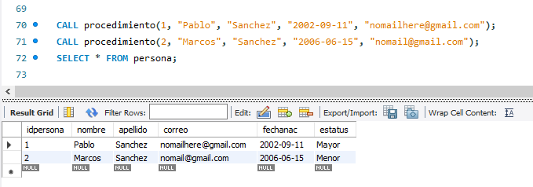

Script
======

```sql
-- Script de la tarea 1
CREATE DATABASE	personal;
USE personal;

CREATE TABLE nacionalidad (
    idnacionalidad int PRIMARY KEY NOT NULL,
    pais varchar(45)
);

CREATE TABLE persona (
    idpersona int PRIMARY KEY NOT NULL,
    nombre varchar(45),
    apellido varchar(45),
    correo varchar(45)
);

CREATE TABLE control (
    idcontrol int PRIMARY KEY NOT NULL,
    idpersona int NOT NULL,
    idnacionalidad int NOT NULL,
    fecha DATE,
    
    INDEX(idpersona),
    FOREIGN KEY (idpersona) REFERENCES persona(idpersona),
    INDEX(idnacionalidad),
    FOREIGN KEY (idnacionalidad) REFERENCES nacionalidad(idnacionalidad)
);

--
-- Utilizando la base de datos personal, creada en la actividad 1, agregue los
-- siguientes campos en la tabla persona:
-- * fechanac  date
-- * estatus varchar(8)
-- Al final se muestra la tabla con los cambios efectuados.
--

ALTER TABLE persona	ADD fechanac date;
ALTER TABLE persona	ADD estatus varchar(8);
DESCRIBE persona;

--
-- Crear un procedimiento que al llamarlo se le puedan enviar parámetros y haga
-- un insert en la tabla persona, al mismo tiempo por medio de un IF que evalúe
-- fechanac, si es mayor de edad que guarde en el campo estatus ‘Mayor’ de lo
-- contrario ‘Menor’.
--     call procedimiento(idpersona,nombre,apellido,fechanac,correo);  
--

DELIMITER //
CREATE PROCEDURE procedimiento(id int,
                               nombre varchar(45),
                               apellido varchar(45),
                               fechanac date,
                               correo varchar(45))
BEGIN
    DECLARE estatus varchar(8);
    DECLARE edad int;
	SET edad = YEAR(NOW()) - YEAR(fechanac);
    IF edad > 18 THEN
		SET estatus = "Mayor";
	ELSE
		SET estatus = "Menor";
    END IF;
    
    INSERT INTO persona
		VALUES (id, nombre, apellido, correo, fechanac, estatus);
END //
DELIMITER ;

CALL procedimiento(1, "Pablo", "Sanchez", "2002-09-11", "nomailhere@gmail.com");
CALL procedimiento(2, "Marcos", "Sanchez", "2006-06-15", "nomail@gmail.com");
SELECT * FROM persona;
    
-- Cleanup
DROP PROCEDURE procedimiento;
DROP DATABASE personal;
```

Prueba de que se ejecuto el procedimiento
=========================================


