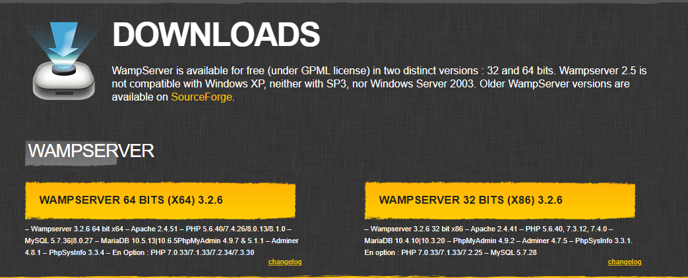
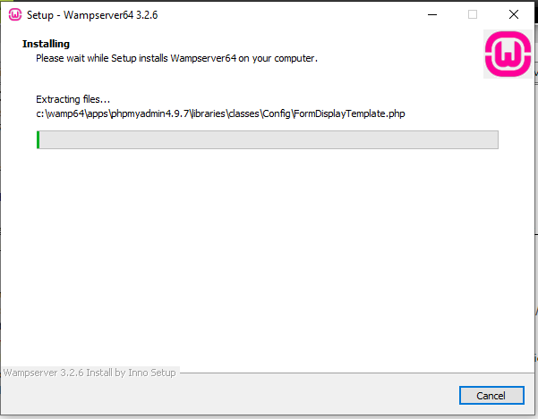

Resumen del proceso de instalación
==================================

Primero, busque en Google "WAMP server".


Dentro del sitio del primer resultado, fui a la sección de descargas,
y descargue la versión de 64 bits.



Luego seguí las instrucciones que da el instalador.


Al parecer me faltaban varios redistribuibles.


Así que tuve que ir al sitio que me indicaban para descargarlos.


Y luego de instalarlos todos, tuve que reiniciar mi pc y volvi a correr el
instalador.



Resumen de la configuracion
===========================

Luego de correr el instalador, me pidio seleccionar un navegador y editor de
texto. Elegi brave y neovim respectivamente.

Manejo post instalacion
=======================

Al iniciar wamp server, y entrar a `localhost`, podemos ver que ya esta
corriendo.


Como otra prueba, voy a crear un proyecto llamado `test`, y en el voy a crear
un archivo `index.php` con el contenido:

```php
<!DOCTYPE html>
<html lang="en">
<head>
    <meta charset="UTF-8">
    <meta name="viewport" content="width=device-width, initial-scale=1.0">
    <title>Hola mundo</title>
</head>
<body>
    <?php phpinfo() ?>
</body>
</html>
```

Y al entrar a `localhost/test`, podemos ver que esta funcionando correctamente


Comentario personal
===================

Me parece una buena herramienta, sencilla de instalar, y es muy fácil montar
los proyectos. Ademas de que ya viene pre-configurada. Pero para ser sincero, no
se suficiente sobre las herramientas que junta como para dar una opinión
completa.
