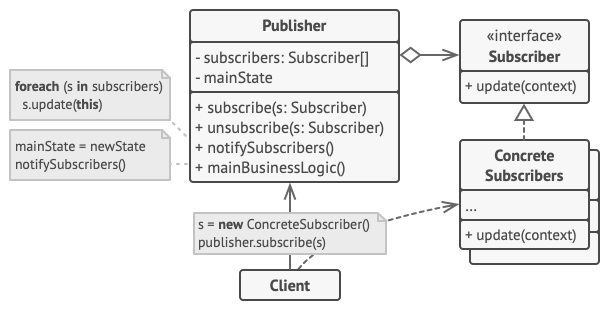

Problema 1
==========

**¿Cuál cree usted que es la razón que originó el inconveniente de las
conexiones hacia la base de datos?**

>  Pablo Mármol menciona que:

>  > recordó que trabajó una clase que se llama\
>  > `ManejadorDeConexionABaseDeDatos` la cuál gestiona todas las interacciones
>  > con la base de datos y *que instanció cada vez que necesitó realizar
>  > alguna consulta*

>  Ya que `ManejadorDeConexionABaseDeDatos` tiene un miembro `conexion`, al
>  instanciar la clase también crea una conexión nueva a la base de datos. Esto
>  no es necesariamente malo, el problema es que cada vez que necesita realizar
>  una nueva consulta, crea otra instancia de la clase.

**¿Qué patrón de diseño de software le recomendaría utilizar a Pablo Mármol?**

> Singleton 

**¿Cómo solucionaría el patrón de diseño que recomienda a Pablo Mármol en el
problema planteado?**

>  Al limitar las instancias a 1, la aplicación solo puede tener una conexión.

**Después de aplicado el patrón de diseño a recomendar cuál sería la nueva
estructura de la clase `ManejadorDeConexionABaseDeDatos`?**

   

**¿Qué otra solución podría aplicarse al problema que se enfrenta Pablo
Mármol?**

>  Si quiere complicarse la vida, puede tratar de hacerlo funcionar con un
>  Object Pool. O si quiere cubrir sus errores en la implementación, puede
>  cambiar a una base de datos que acepte mas conexiones simultaneas.

Problema 2
==========

**¿Qué tipo de patrón de diseño le recomendaría utilizar? (comportamiento,
creacional, estructural)**

>  Comportamiento

**¿Qué patrón de diseño le recomendaría?**

>  Observer

**¿Cómo le ayudaría a resolver el problema que presenta Pedro Picapiedra el
patrón planteado?**

>  Cuando la posición en la cola del usuario cambie, se le notificara para que
>  se actualiza en su pantalla y el usuario no se le pase su turno.

**Explique por medio de un diagrama UML el funcionamiento del patrón de
diseño.**

**¿Qué otras formas o tecnologías se podrían utilizar para solventar de mejor
forma el inconveniente al que se enfrenta Pedro Picapiedra?**

>  No conozco spring framework, pero lo que sea el equivalente
>  a [**socket.io**](https://socket.io/) dentro del mismo debería funcionar
>  perfectamente.
