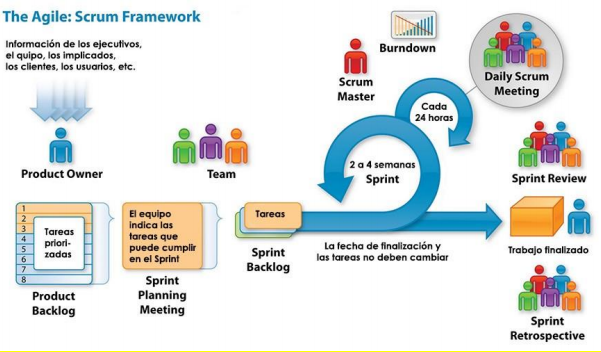

Software
========

**Definición formal:**

> El Software es un conjunto de instrucciones que se ejecuta en una computadora
> para poder manipular y procesar datos que cumplen los requerimientos de una
> tarea específica.

Por ello se dice que es el componente lógico, al contrario del hardware.

Este es desarrollado usando distintos lenguajes de programación. Estos son un
conjunto de símbolos y reglas que representan instrucciones para las
computadoras. El lenguaje de nivel mas bajo son 1s y 0s. Pero nosotros
programamos en lenguajes de nivel mas alto, que luego son compilados
o interpretados.

**Definición de la IEEE:**

> El conjunto de los programas de cómputo, procedimientos, reglas,
> documentación y datos asociados, que forman parte de las operaciones de un
> sistema de computación

Características
---------------

* Este se desarrolla, no se fabrica.
* Este no se desgasta: El este al deteriorarse queda obsoleto, ya sea gracias
  a los cambios, correcciones y problemas de compatibilidad de su entorno
  operativo.
* La mayoría de el software se construye a la medida.

## Evolución

Este se puede dividir en 5 eras:

### 1955-1965

* Se realizaba sin planteamiento previo.
* No existían fuentes de información
* Desarrollo a base de prueba y error

### 1965-1972

* Software como producto.
* Simplificación del código.
* Aparición de el multiprocesamiento y las bases de datos.
* Inicia "Crisis del software", donde muchos proyectos sobrepasaron su tiempo
  estimado y presupuesto.
* Se definen procedimientos para el desarrollo.

### 1972-1985

* Concepto de "Sistemas Distribuidos" (Uso de múltiples ordenadores).
* Implementaron de redes a nivel local y global.
* Se definen metodologías para el diseño y análisis.

### 1985-2000

* Se implementan redes de información y tecnologías orientadas a objetos.
* Auge del Internet
* Fortalecimiento de la seguridad informática.

### 2000-Presente

* Aplicaciones móviles
* Inteligencia artificial
* Realidad virtual

Ingeniería de software
----------------------

Gracias a la combinación de métodos para realizar el desarrollo, herramientas
automatizadas, técnicas para garantizar la calidad del software y una filosofía
predominante para la coordinación, control y gestión, nace la ingeniería de
software.

Esta contiene 3 elementos clave:

### Métodos

Indican como construir el software. Describen las tareas de:

* Planificación y estimación.
* Análisis de requerimientos.
* Diseño de la estructura de datos.
* Arquitectura de programas y algoritmos.
* Codificación.
* Prueba.
* Mantenimiento

### Herramientas

Dan un soporte automatizado para la implementación de los métodos.

### Procedimientos

Indican la secuencia en la que aplican los métodos.

Procesos para la construcción de software
-----------------------------------------

La creación de software se simplifica si se definen y utilizan procesos que
luego se estandarizan.

Se necesitan estas definiciones:

* **Proceso:** Es un conjunto de actividades que tienen que realizarse.
* **Actividad:** Cualquier acción definida a un objetivo a grandes rasgos del
  proyecto.
* **Acción:** Realización de tareas que producen un avanza del proyecto.
* **Tarea:** Objetivo pequeño y bien definido.

En resumen, *un proceso define las acciones de cada individuo, cuando devén ser
realizadas y de que manera tienen que realizarse*.

### Estructura de un proceso

Este consta de 5 actividades, que suelen realizarse en orden y se repiten con
cada proyecto.

* **Comunicación:** Se realiza con el cliente, y se tiene el objetivo de
  obtener los requerimientos y objetivos del proyecto.

* **Planeación:** Da la guía para conocer los pasos, tareas y acciones que
  devén realizarse. 

* **Modelado:** Es una representación del producto terminado, que ejemplifica
  algunas funcionalidades y características del producto al cliente. Esta
  representación se usa como guía para los desarrolladores y evita malos
  entendidos.

* **Construcción:** Se genera el código y las pruebas de control de calidad. 

* **Despliegue:** Se entrega al cliente para recibir retoalimentación, se hacen
  los mínimos ajustes y se pasa al ambiente de producción.

### Flujos del proceso

Define el orden en el que se hacen los 5 componentes.

#### Lineal

Se realizan las actividades en el orden planteado arriba.

#### Iterativo

Aquí se repiten las actividades para realizar correcciones bajo la marcha de
ser necesario. Usualmente se hace regresando la actividad `Comunicacion`.

#### Evolutivo

Las actividades se realizan en orden, repitiéndose varias veces, para cada vez
entregar versiones con mayor funcionalidad.

#### Paralelo

Como lo dice el nombre, aquí las tareas se hacen de forma simultanea. Por
ejemplo se puede hacer la planeación junto al modelado.

### Modelos o ciclo de vida

Es una vista de las actividades que ocurren durante el desarrollo.

#### Cascada

Es conocido como el ciclo de vida clásico del software, ya que su enfoque es
llevar las tareas en secuencia. Este se usa cuando los requerimientos no
cambian.

#### Incremental

Este es el que se usa cuando hay factores que impiden que el proceso sea
lineal. Es una mezcla del proceso lineal y paralelo. Se trabaja linealmente
hasta tener un software básico. Luego se van programando los siguientes módulos
o incrementos.

#### Prototipos

Este se suele usar cuando el tiempo de lanzamiento es critico. Se aíslan
diferentes componentes y se trabajan en el orden que sean necesarios. Al
momento del despliegue son nuevas versiones del producto.

#### En espiral

Es una mezcla del modelo en cascada y el de prototipos. Cada vez que se realiza
un ciclo de el modelo de cascada, el prototipo tiene mayor funcionalidad.

#### Concurrente

Usualmente se usa cuando varios equipos están involucrados. Por ejemplo, un
equipo hace la interfaz, y otro hace la API.

#### Basado en componentes

Es muy similar al modelo en espiral. En cada iteraron se realiza un componente
nuevo.

Desarrollo rápido de aplicaciones (RAD)
---------------------------------------

Esta cambia el enfoque a la creación de prototipos usando herramientas
asistidas por computadora.

Por ejemplo, para una pagina web simple, se pueden utilizar herramientas en las
que un desarrollador construye el sitio arrastrando componentes.

RAD funciona muy bien para pequeñas empresas, donde los usuarios comerciales
son dueños del presupuesto.

### Pasos

1. **Planificación de requerimientos**
2. **Diseño con el usuario:** Se trabaja en estrecha colaboración con los
   clientes para crear y mejorar los prototipos.
3. **Construcción:** Una vez se define el alcance del proyecto, se puede
   comenzar el desarrollo.
4. **Transición:** Conversión de datos y capacitación del usuario.

### Herramientas

### Diseño y prototipo

Figma, InVision y Adobe XD permiten a los expertos en UI y UX construir
rápidamente prototipos.

### Construcción

#### Plataformas de bajo código

Esta permite a los usuarios sin habilidades de desarrollo entregar aplicaciones
de trabajo muy rápidamente. Estas plataformas se limitan a la creación de
sistemas muy básicos. **Ejemplos:** Wix, Mendix, Kissflow.

#### Plataformas enfocadas en el desarrollador

Estas son herramientas de generación de código, con lo que los desarrolladores
se mantienen alejados de escribir código repetitivo.

Proceso Racional Unificado
--------------------------

Este proporciona un enfoque disciplinado para asignar tareas
y responsabilidades dentro de una organización de desarrollo. Este proceso es
considerado pesado y preferiblemente aplicable a grandes equipos de desarrollo
y grandes proyectos.

Esta busca que todo el equipo siga las siguientes mejores practicas:

1. Desarrollar software iterativamente
2. Gestionar requisitos
3. Usar arquitecturas basadas en componentes
4. Utilizar software de modelado visual
5. Verificar la calidad del software

Este se puede separar en 2 ejes:

* **Horizontal:** Representa el tiempo. Se expresa en términos de ciclos, fases
  e iteraciones.
* **Vertical:** Es el aspecto estático del proceso, se describe en términos de
  actividades, artefactos, trabajadores y flujos de trabajo.

### Fases

#### Inicial

Es esta etapa, los requisitos esenciales del sistema se trasforman en casos de
uso. Aquí se define si es factible el proyecto, y se definen los riesgos y los
costos. Se puede hacer un prototipo para que el cliente lo apruebe.

#### Elaboración

Aquí se crea el plan del proyecto y se eliminan los elementos de mayor riesgo.
Para eso se tiene que tener una vista amplia del problema a resolver.

#### Construcción

Aquí comienza el desarrollo del software, códigos de producción y pruebas alfa.
Las pruebas beta se llevan a cabo al comienzo de la fase de transición.

#### Transición

Aquí los productos se entregaran al cliente. Aquí va la capacitación del
usuario y el monitoreo.

Metodología Ágil
----------------

La declaración central del Manifiesto Ágil dice: "Estamos descubriendo mejores
formas de desarrollar software haciéndolo y ayudando a otros a hacerlo".

### Manifiesto Ágil

Los siguientes son los 12 principios principales de la metodología ágil:

1. Nuestra mayor prioridad es satisfacer al cliente mediante la entrega
   temprana y continua de software con valor.

2. Aceptamos que los requisitos cambien, incluso en etapas tardías del
   desarrollo. Los procesos Ágiles aprovechan el cambio para proporcionar
   ventaja competitiva al cliente.

3. Entregamos software funcional frecuentemente, entre dos semanas y dos meses,
   con preferencia al periodo de tiempo más corto posible.

4. Los responsables de negocio y los desarrolladores trabajamos juntos de forma
   cotidiana durante todo el proyecto.

5. Los proyectos se desarrollan en torno a individuos motivados. Hay que darles
   el entorno y el apoyo que necesitan, y confiarles la ejecución del trabajo.

6. El método más eficiente y efectivo de comunicar información al equipo de
   desarrollo y entre sus miembros es la conversación cara a cara.

7. El software funcionando es la medida principal de progreso.

8. Los procesos Ágiles promueven el desarrollo sostenible. Los promotores,
   desarrolladores y usuarios debemos ser capaces de mantener un ritmo
   constante de forma indefinida.

9. La atención continua a la excelencia técnica y al buen diseño mejora la
   Agilidad.

10. La simplicidad, o el arte de maximizar la cantidad de trabajo no realizado,
    es esencial.

11. Las mejores arquitecturas, requisitos y diseños emergen de equipos auto
    organizados.

12. A intervalos regulares el equipo reflexiona sobre cómo ser más efectivo
    para a continuación ajustar y perfeccionar su comportamiento en
    consecuencia.

### Marcos de trabajo

Los marcos de trabajo ágiles funcionan de forma similar, con ciclos de trabajo
llamados sprints que se ejecutan de forma iterativa.

Los marcos de trabajo mas populares son los siguientes:

#### Scrum

##### Roles

* **Scrum Master:** Es un facilitados y responsable de que el equipo se adhiera
  a los valores y principios e la metodología ágil.
* **Propietario:** Es el cliente, o alguien designado de la organización que
  conoce sus necesidades.
* **Equipo Scrum:** Las personas que forman el grupo de trabajo.

##### Ceremonias

* **Planificación del sprint**
* **Scrum Diario:** Esta es una reunión de no mas de 15 minutos para asegurarse
  de que todo el equipo esta en la misma pagina.
* **Revisión del sprint:** El equipo muestra lo terminado en el sprint.
* **Retrospectiva:** Para revisar el desempeño del equipo.

##### Artefactos

Estos son los que garantizan la transparencia y organización de las actividades
a realizar.

* **Lista de producto (Product Backlog):** Es una lista ordenada de los
  requerimientos.
* **Lista de actividades especificas del sprint(Sprint backlog):** Es el
  conjunto de actividades que promete realizar el equipo al finalizar el sprint.
* **Incremento:** Es la suma de las actividades realizadas en el sprint.

##### Flujo de trabajo

Se sigue el siguiente flujo:

### Extreme Programming (XP)

Este se enfoca en adaptar sobre la marcha el software según las necesidades del
cliente. Según esta metodología, los cambios son naturales, y se pueden aplicar
en cualquier etapa del proyecto.

Una practica común es la programación en parejas, en la cual una realiza el
trabajo y otra revisa en tiempo real. Esto permite discutir mejoras y evitar
errores.

#### Proceso

1. Planificación
2. Diseño
3. Codificación (Y refactors)
4. Testing
5. Release

Dudas para clase
================

1. ¿Relación entre flujos de proceso, y modelos?
   **Motivo:** Flujo lineal = Modelo en cascada, Evolutivo = Espiral.
   **Respuesta:** El flujo es la parte teórica, y el modelo la implementación
