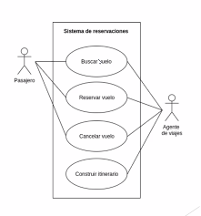

Recolección de requerimientos
=============================

Tenemos que recabar la mayor cantidad de información para poder construir la
solución adecuada.

En la recolección de requerimientos participan tanto el desarrollador como el
cliente. Puede que el cliente no de una idea clara, así que el desarrollador
tiene que actuar como interrogador, consultor, como persona que resuelve
problemas y como negociador.

Principios
----------

* **Escuchar** y hacer preguntas si algo no esta claro.
* **Prepararse** investigando el negocio. Y de ser encargados de las reuniones,
  tenemos que tener una agenda.
* **Tomar notas** de los puntos claves y los temas tratados. Importante tomar
  nota de las decisiones.
* **Perseguir la colaboración**
* **Permanecer centrado en el tema**
* **Si algo no esta claro, diagramar.** Ya que esto puede ayudar a transmitir
  ideas.
* **Avanzar** en casos de que no se este haciendo mucho progreso.
* **La negociación no es un concurso**, esta demanda compromiso de todas las
  partes.

Herramientas
------------

1. **Entrevistas** (Tanto reuniones uno a uno como reuniones grupales). En
   estas tenemos que hacer varias clases de preguntas. **Ejemplos:** ¿Quién
   utilizará el sistema? ¿Cuáles son los objetivos del sistema? ¿Cuáles son los
   beneficios de esta solución?. También presenta la oportunidad de aclarar
   dudas de el cliente.
2. **Talleres** en los que trabajaremos juntos para llegar a los requisitos. La
   diferencia con las entrevistas es que estos tienen un tiempo definido, pero
   pueden ser iterativos.
3. **Lluvias de ideas** en las que las personas involucradas nos ayudan
   a identificar los requerimientos.
4. **Cuestionarios**. Estos son buenos porque son versátiles, y le permiten al
   cliente responder a su ritmo y en su tiempo.
5. **Observación/Seguimiento.** Aquí iremos a las instalaciones del cliente
   a observar como se trabaja, que información necesitan, las limitantes que
   tienen, etc.
6. **Historias de usuario.** Es una definición de alto nivel de un requisitos
   para que nosotros o otro desarrollador pueda dar una estimación razonable de
   el esfuerzo necesario para implementarlo.

Análisis de requisitos
======================

Los diferentes métodos de análisis de los requisitos que se han establecidos se
basan en una serie de principios fundamentales que permiten dar un enfoque
sistémico al problema a resolver. Roger S. Pressman identifica los siguientes
principios:

* Se debe comprender el ámbito de información del problema.
* Se deben desarrollar los modelos que representan la información, función y el
  comportamiento del sistema.
* Se deben subdividir los modelos (y el problema) de forma que se descubran los
  detalles de una manera progresiva (o jerárquica).
* El proceso de análisis debe ir de la información esencial hacia el detalle de
  la implementación

Clasificación
-------------

### Requisitos funcionales

Son las funcionalidades que tiene que tener el software. Como tiene que
reaccionar a entradas y situaciones particulares.

### Requisitos no funcionales

Restricciones de tiempo, en el proceso de desarrollo, de seguridad, etc.

### Requisitos de dominio

Son los que vienen de el dominio de la aplicación. Así como las reglas del
negocio.

Casos de uso
------------

Caracteriza una forma de usar el sistema. Es un dialogo entre el usuario y el
sistema. Este ayuda a entender los requisitos del cliente.

### En diagramas UML

En estos listamos en diagramas de alto nivel los casos de uso del sistema.

### Formales

En estos se debe detallar a profundidad cada caso. **Ejemplo:**

| Campo              | Descripción                                |
|--------------------|--------------------------------------------|
| Objetivo           | Un pasajero podra reservar boletos         |
| Actor              | Pasajero                                   |
| Ambito             | Sistema de reservaciones en linea          |
| Nivel              | Usuario                                    |
| Pre-condicion      | Pasajero deve iniciar sesion en el sistema |
| Condicion de exito | Se reserva el vuelo                        |
| Condicion de fallo | No se puede reservar el vuelo              |
| Desencadenante     | Click en boton: "Reservar vuelo"           |
| Etc                | Etc                                        |

#### Pasos para crearlos

1. Identificar actores y objetivos
2. Escribir el escenario exitoso
3. Enumerar las posibles fallas
4. Listar las variaciones

### Informales

Estos son un párrafo que describe el escenario.

Dividir historias de usuario
----------------------------

Aprender a dividir historias de usuario largas en historias más pequeñas es una
de las mejores cosas que un equipo puede realizar para mejorar su flujo de
trabajo de Scrum.

Las historias horizontales son aquellas que pertenecen a una capa estructural
del sistema, como la base de datos, la interfaz de usuario, etc. Las historias
verticales son todas aquellas historias que cruzan todos los límites de la
arquitectura del sistema, pero solo implementan una funcionalidad a la vez

Diseño
======

Tiene como objetivo crear un modelo que pueda ser utilizado como guía para
implementar la funcionalidad y al mismo tiempo buscando incluir una estética
agradable al producto final

Aquí también se definen nen los estándares de calidad para el programa. Deben
definirse pruebas y definir las entradas y salidas esperadas del programa.

Diseño modular
--------------

Este permite la división de problemas grandes en múltiples problemas pequeños.
El software es dividido en varios componentes con distintos nombres, cada uno
conocido como un modulo. Cada modulo tiene que trabajar independiente de otros
módulos, o en términos formales, tienen que tener independencia funcional.

El costo que tiene el trabajar con módulos es la integración de componentes.

Arquitectura de Software
------------------------

Ademas de dividir el Software en módulos, se necesita realizar el diseño de la
arquitectura de cada uno de esos módulos. A partir de los requisitos se hacen
las estructuras de datos y la del programa.

La arquitectura de software cuenta con 5 componentes principales:

* **Estructura funcional:** Representan las instancias de una función o proceso.
* **Estructura de implementación:** Son los paquetes, clases, objetos,
  procedimientos, funciones, etc. que se usan para ejecutar distintos grados de
  abstracción.
* **Estructura de concurrencia:** Son tareas que se pueden realizar de manera
  paralela.
* **Estructura física:** Son los componentes de hardware físico que necesita el
  software para poder llevar a cabo las tareas.
* **Estructura de desarrollo:** Define los componentes, productos de trabajo
  y fuentes de información que se requieren durante el proceso de ingeniería de
  software.

### Arquitecturas basadas en datos

Esta tiene la característica de que en el centro de la misma tiene una
estructura de almacenamiento de datos o una base de datos. Estos datos son
solicitados y modificados frecuentemente.

### Arquitectura de flujo de datos

Aquí se sigue un flujo definido, en el que ingresa información y se transforma
por medio de varios componentes. Se puede hacer una analogía con un sistema de
tuberías.

### Arquitectura de llamar y regresar

Este estilo de arquitectura se comporta de manera jerárquica, es decir que un
programa principal requiere e invoca a varios componentes y cada componente
invoca a otros subcomponentes. Otra variante de esta arquitectura son las de
llamada de procedimiento remoto. En esta variante, se ejecutan funciones por
medio de integraciones en computadoras que están interconectadas a través de
una red.

### Arquitectura orientada a objetos

Los componentes se modelan en clases en la cual se definen atributos y métodos
que modifican la información.

### Arquitectura en capas

Se definen múltiples capas, con varios niveles de abstracción, desde la
presentación de interfaces de usuario hasta operaciones básicas del computador.

Proceso de diseño
-----------------

Aquí se traducen los requisitos a una representación del software. Se realiza
en 2 pasos:

1. **Diseño preliminar:** Realiza la transformación de los requisitos de datos
   y arquitectura.
2. **Diseño detallado:** Realiza un refinamiento de la estructura
   arquitectónica, se obtiene una estructura de datos detallada y la estructura
   algorítmica del software. Ademas se realiza el diseño de la interfaz.

Codificación
============

Se refiere a la creación detallada del software por medio de la codificación,
verificación, pruebas y depuración. Estos dependen de los siguientes aspectos:

1. **Minimizar la complejidad:** Esto se alcanza mediante el uso de código
   simple y legible.
2. **Anticiparse a los cambios.**
3. **Construir para verificar:** Se tiene que construir de tal manera que los
   desarrolladores deben ser capaces de detectar fallas con facilidad.
4. **Gestión de la construcción:** El proceso de planificación también define
   el orden en el que se crean los componentes.
5. **Consideraciones practicas:** El diseño queda determinado por las
   restricciones que impone el problema de la vida real.

Se tienen que tener en cuenta las siguientes consideraciones:

* El código fuente debe ser comprensible.
* Debe considerarse el tratamiento de errores tanto planeado como las
  excepciones.
* Deben prevenirse las brechas en la seguridad a nivel de código.
* El código fuente debe organizarse en rutinas, clases, paquetes y otras
  estructuras.
* El código debe documentarse. 

Durante el proceso se realizan 2 tipos de pruebas, unitarias y de integración.

Aseguramiento de la calidad
===========================

La calidad depende completamente de la concordancia con los requisitos dados.
El aseguramiento de la calidad de software (en ingles `SQA`) es un conjunto de
actividades que se aplican a lo largo del el proceso de desarrollo.

Este comprende una serie de actividades:

1. Aplicación de métodos técnicos
2. Realización de revisiones técnicas
3. Prueba del software
4. Ajuste de los estándares
5. Control de cambios
6. Mediciones
7. Registro y realización de informes

Revisión del software
---------------------

Estas sirven para validar la calidad o el estado de un producto. Estas se
aplican en diferentes momentos de el desarrollo.

Despliegue
==========

Este comprende todas las actividades que hacen que un sistema este disponible
para su uso.

Algunas recomendaciones son:

Usar lista de verificación de implementación
--------------------------------------------

Desplegar es una tarea simple una vez se tiene un proceso. Es importante tener
indicadores del rendimiento del software para saber que con los nuevos cambios
todo este funcionando sin problemas.

Elegir las herramientas adecuadas
---------------------------------

En general se desean herramientas que funcionen de forma nativa con la
infraestructura de su aplicación.

Usar un servidor de integración continua
----------------------------------------

Los servidores de CI a veces se denominan "servidores de compilación" porque
toman el código fuente y lo empaquetan en un artefacto de aplicación. La
integración continua también incorpora principios de pruebas continuas, donde
los equipos recopilan constantemente comentarios para detectar problemas lo
antes posible.

Adoptar la entrega continua
---------------------------

El objetivo de la entrega continua es tener aplicaciones que estén siempre
listas para desplegarse. Esto no solo acelera la implementación del software,
también se ha demostrado que produce software de mayor calidad. 

Mantenimiento
=============

Una vez en funcionamiento, se descubren los defectos, los entornos operativos
cambian y aparecen nuevos requisitos de los usuarios.

El mantenimiento es necesario para garantizar que el software continué
satisfaciendo los requisitos del usuario.

Para tener un mantenimiento adecuado se necesita:

* Tener un seguimiento del sistema, a efecto de evaluar la alimentación de
  datos, ejecución de procesos, revisión de resultados y respaldo de la
  información.
* Evaluar el empleo de recursos y tiempo de respuesta que ocupa el sistema en
  su operación, para optimizarla.
* Analizar detalladamente las fallas detectadas, así como los nuevos
  requerimientos antes de iniciar cualquier alteración.
* Incorporar las experiencias y avances tecnológicos para la optimización del
  sistema.
* Respaldar el sistema antes de comenzar los cambios.
* Durante la modificación, respetar las normas, estándares y procedimientos que
  han respaldado la construcción del sistema.
