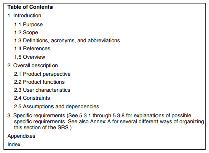

Que es?
=======

Según la wikipedia [-@wikipedia], la ERS es: "una descripción completa del
sistema que se va a desarrollar."

Según la @iee [p.3], la ERS es: "Una especificación para un producto de
software, programa, o grupo de programas que realiza ciertas funciones en un
ambiente especifico"

Partes importantes
==================

Según la @iee [p.10-19], un outline a seguir al escribir una ERS es el
siguiente:

Aunque menciona que un buen ERS no necesariamente tiene que seguir el outline
al pie de la letra. Pero que si debería incluir toda la información presentada
aquí:

1 Introducción
---------------

Esta tiene que proveer un panorama general de todo el ERS. Contiene las
siguientes sub-secciones:

### 1.1 Propósito 

Aquí se especifica el propósito de el ERS, y también la audiencia objetivo.

### 1.2 Alcance

Esta sección tiene que:

1. Identificar los productos por nombre
2. Explicar que, y de ser necesario que no, harán los productos.
3. Describir la aplicación del producto, así como beneficios y metas.

### 1.3 Definiciones, acrónimos y abreviaciones

Tiene que dar toda la información necesaria para interpretar el ERS.

### 1.4 Referencias

Esta sección tiene que:

1. Dar una lista completa de todos los documentos a los que se hace referencia
   en otro lado en el ERS.
2. Identificar cada documento por: titulo, numero de reporte (si aplica),
   fecha, y organización.
3. Especificar las fuentes de donde se pudieron haber obtenido las referencias.

### 1.5 Visión General

Esta explica que es lo que contiene el resto del ERS y como esta organizado.

2 Descripción General
---------------------

Esta explica los factores generales que afectan al producto y sus requisitos.

**Nota:** Esta sección no da los requisitos específicamente, sino que da el
trasfondo a los mismos - que se definen en la sección 3 - y los hace mas
fáciles de entender.

### 2.1 Perspectiva del producto

Esta coloca el producto en perspectiva con otros productos relacionados. O si
el producto es independiente y completamente autónomo.

Este describe como el software opera con respecto a:

1. Interfaces de Sistema
2. Interfaz de usuario
3. Interfaces de hardware
4. Interfaces de Software
5. Interfaces de comunicación
6. Memoria
7. Operaciones
8. Requisitos de adaptabilidad del sistema

### 2.2 Funciones del producto

Esta contiene un resumen de las funciones mas grandes que tiene que tener el
software.

Estas tienen que estar organizadas de un modo que la lista de funciones sea
entendible para cualquier persona leyendo el documento por primera vez.

### 2.3 Características de Usuario

Estas describen las características generales del el usuario objetivo del
software. Incluye nivel educativo, experiencia, capacidad técnica, etc.

### 2.4 Limitaciones

Esta da una lista de cosas que van a limitar las opciones del desarrollador.
Incluye:

1. Políticas reguladoras
2. Limitaciones de Hardware
3. Interfaces a otras aplicaciones
4. Operaciones paralelas
5. Funciones para auditar
6. Funciones de control
7. "Requisitos de idioma de orden superior" (Traducción por Google, no se que
   es)
8. Protocolos de señales manuales
9. Requisitos de fiabilidad
10. Criticidad de la aplicación
11. Consideraciones de seguridad

### 2.5 Supuestos y dependencias

Por ejemplo, que el programa se utilizara en un sistema operativo especifico.

### 2.6 Prorrateo de los requisitos

Aquí se explican requisitos que puede que sean atrasados hasta futuras
versiones de el sistema.

3 Requisitos específicos
------------------------

Esta sección de el ERS tiene que contener todos los requisitos del software
a un nivel de detalle suficiente para que los diseñadores puedan diseñar el
sistema, y que los testers puedan hacer las pruebas para verificar que se
cumplen con los requisitos.

Esta suele ser la sección mas grande de el ERS.

### 3.1 Interfaces externas

Esta es una descripción detallada de todas las entradas y salidas de el
sistema. Esta tiene que complementar lo que se menciono en la **sección
2** sin repetir información.

### 3.2 Funciones

Aquí se definen las acciones fundamentales que tienen que tener lugar en el
software. Se describen los requisitos para las entradas, procesamiento
y generación de salidas.

Usualmente se escriben de la siguiente forma: "El sistema debería ..."

Estas incluyen:

1. Checkeos de la valides de las entradas.
2. Las secuencia exacta de las operaciones.
3. Respuestas a situaciones anormales.
4. Efecto de los parámetros.
5. Relacionen entre las entradas y las salidas.

### 3.3 Rendimiento

Aquí se tiene que especificar los requisitos numéricos en de el software. Por
ejemplo:

> *95% de las transacciones se tienen que realizar en menos de 1 segundo*

> *El sistema puede soportar hasta 2000 usuarios a la vez*

### 3.4 Limitaciones de diseño

Aquí se especifican las limitaciones que vengan de estándares, o de hardware.

### 3.5 Atributos de sistema

Aquí se enlistan los atributos que son requisitos como por ejemplo:

1. Seguridad
2. Potabilidad
3. Mantenibilidad

Conclusiones
============

Creo que es una herramienta muy buena. Veo que se puede utilizar tanto con un
ciclo de vida en cascada como con el proceso racional unificado, aunque no veo
alguna forma de utilizarlo con alguna metodología ágil. 

Personalmente no creo poder entender completamente su utilidad, ya que para la
mayoría de los proyectivos que he realizado seria mas trabajo hacer el ERS que
el proyecto en si. Aunque me hubiera gustado saber de el cuando estaba
realizando mi practica supervisada, ya que me hubiera ayudado mucho a trabajar
de una forma organizada.

Bibliografías
=============

**[Link](https://polo123456789.github.io/Universidad/FundamentosDeLaContruccionDeSoftware/Tareas/Unidad2/IEEE830.pdf)**
al estandar citado.

