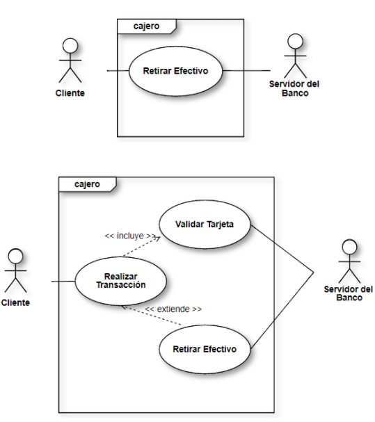

Diagramas de comportamiento
===========================

Estos nos explican el comportamiento de las cosas, que hace y como lo hace.

Diagramas de casos de uso
-------------------------

Estos relacionan a un usuario con la manera en la que usa un sistema.

* Se les dicen "Actores" a los que usan el sistema (También se les dice
  usuarios).
* Un actor es una entidad que usa el sistema. Generalmente son personas, pero
  pueden ser otros dispositivos, etc.

**Este no nos muestra los requerimientos del cliente.** Este diagrama esta
enfocado en los usuarios del sistema.

Diagramas de estado
-------------------

Diagrama de secuencias
----------------------

Este nos muestra la secuencia de los eventos. Nos muestra visualmente lo que
sucede atreves del tiempo. Nos dice quien tiene el control en cada momento.

Objetos
-------

Estos seguimos utilizándolos. Vamos a ver los comportamientos de los objetos
y como se comunican por medio de mensajes y valores.
