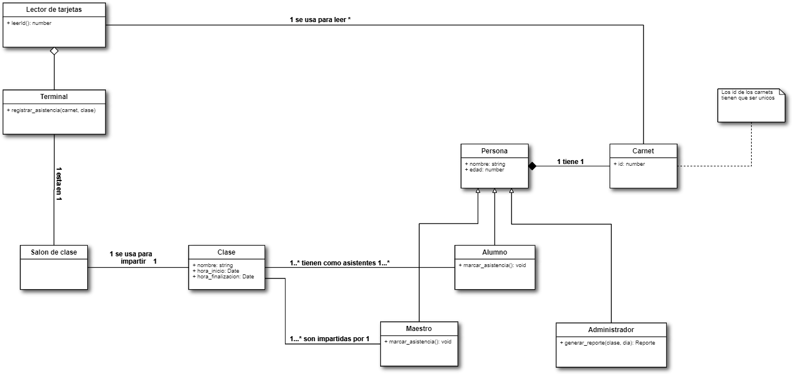
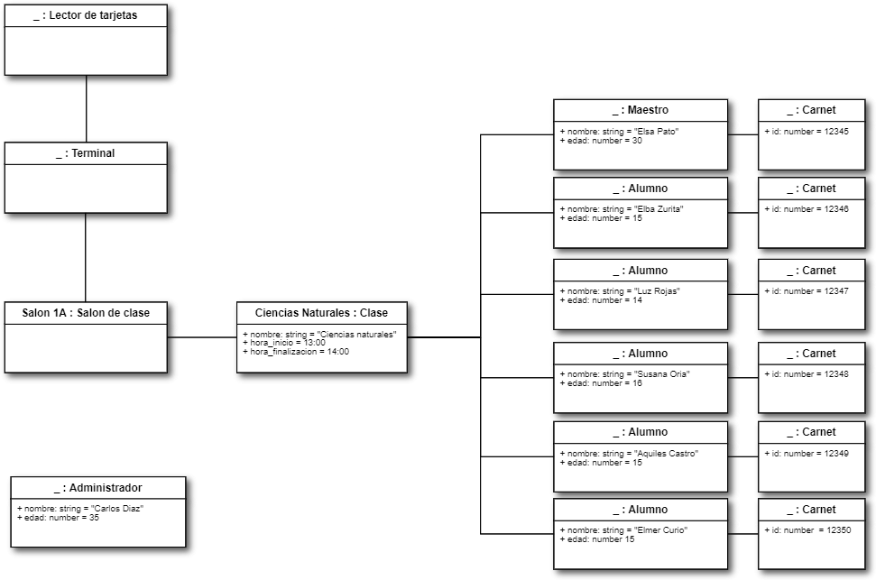
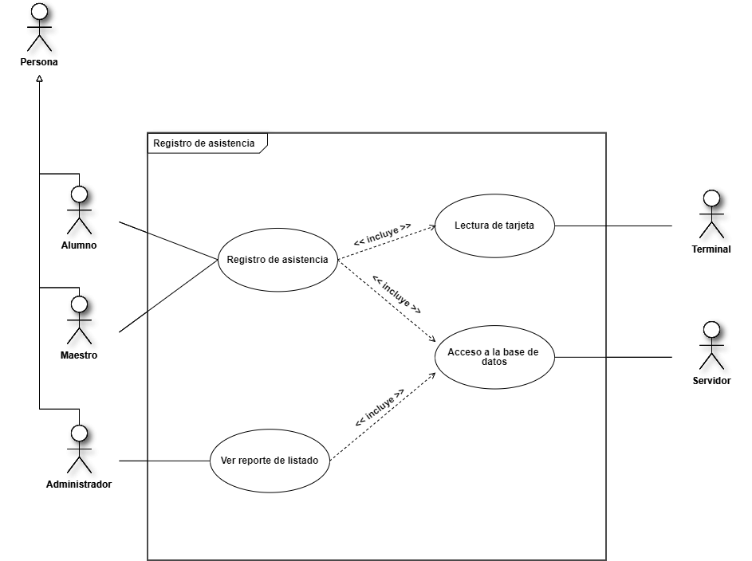
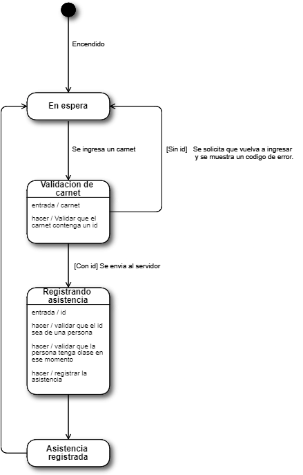
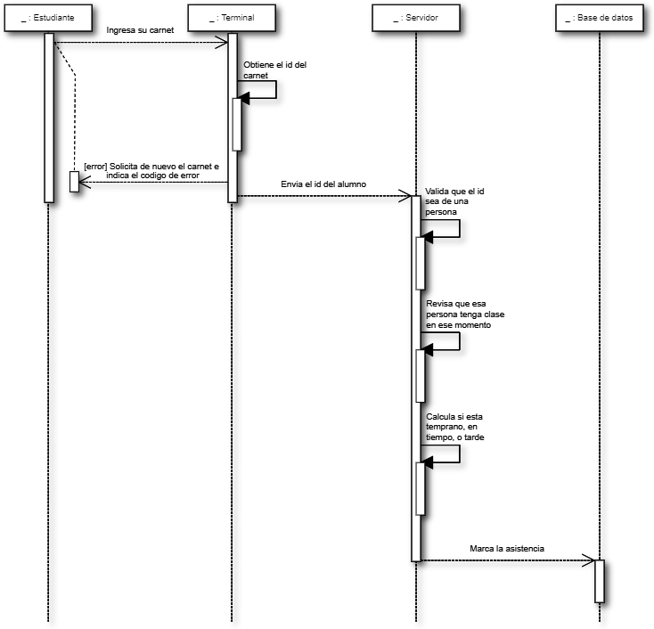
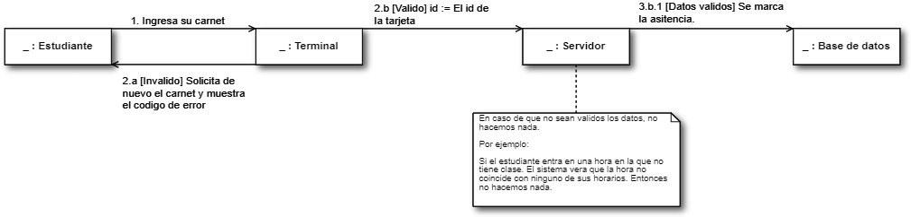
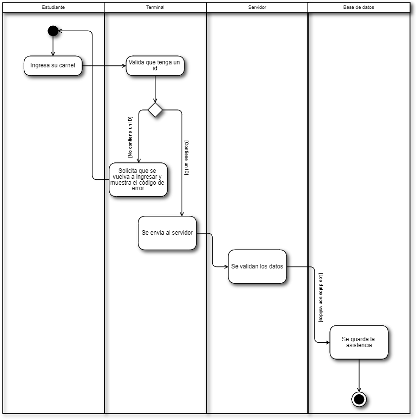
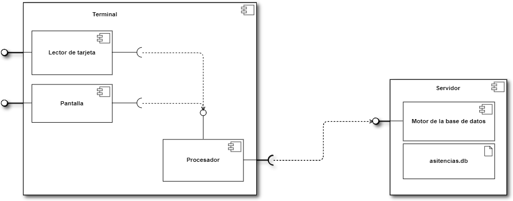
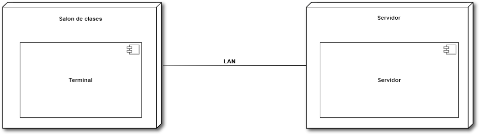

================
Caso de análisis
================

Propuesta
=========

Para solucionar el problema, propongo que se coloque una terminal en cada clase
con un lector de tarjetas incluido. A cada alumno se le asignara un carnet,
y este tendrá su numero de identificación.

Diagrama de clases
==================

Diagrama de objetos
===================

Casos de uso
============

Algoritmos
==========

.. include:: algoritmos.rst

Diagrama de estados
===================

Diagrama de secuencias
======================

Diagrama de comunicación/colaboración
=====================================

Diagrama de actividades
=======================

Diagrama de componentes
=======================

Diagrama de distribución
========================

