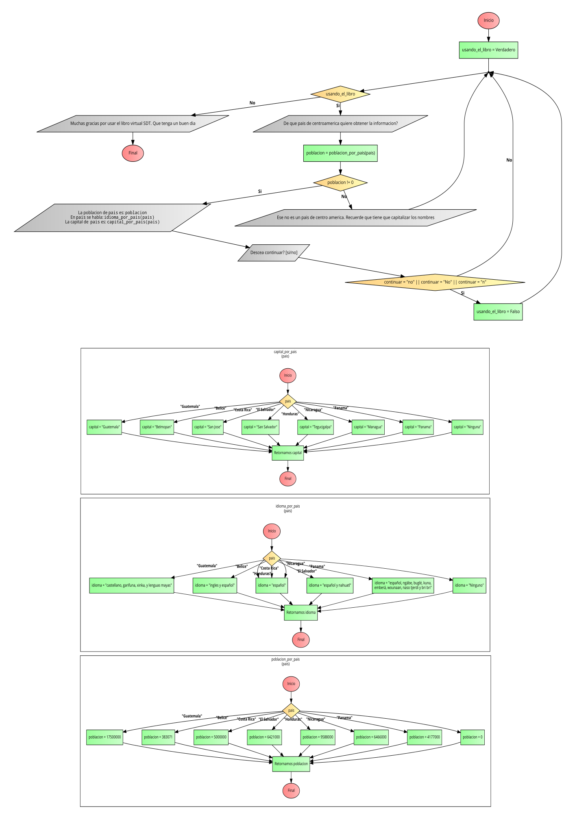

# Pseudocodigo

~~~
Funcion  poblacion <- poblacion_por_pais ( pais )
	Segun pais Hacer
		"Guatemala":
			poblacion <- 17500000
		"Belice":
			poblacion <- 383071
		"Costa Rica":
			poblacion <- 5000000
		"El Salvador":
			poblacion <- 6421000
		"Honduras":
			poblacion <- 9588000
		"Nicaragua":
			poblacion <- 6466000
		"Panama":
			poblacion <- 4177000
		De Otro Modo:
			poblacion <- 0
	Fin Segun
Fin Funcion

Funcion  idioma <- idioma_por_pais ( pais )
	Segun pais Hacer
		"Guatemala":
			idioma <- "castellano, garifuna, xinka, y lenguas mayas"
		"Belice":
			idioma <- "ingles y español"
		"Costa Rica":
			idioma <- "español"
		"El Salvador":
			idioma <- "español y nahuatl"
		"Honduras":
			idioma <- "español"
		"Nicaragua":
			idioma <- "español"
		"Panama":
			idioma <- "español, ngäbe, buglé, kuna, emberá, wounaan, naso tjerdi y bri bri"
		De Otro Modo:
			idioma <- "Ninguno"
	Fin Segun
Fin Funcion

Funcion  capital <- capital_por_pais ( pais )
	Segun pais Hacer
		"Guatemala":
			capital <- "Guatemala"
		"Belice":
			capital <-  "Belmopan"
		"Costa Rica":
			capital <-  "San Jose"
		"El Salvador":
			capital <-  "San Salvador"
		"Honduras":
			capital <-  "Tegucigalpa"
		"Nicaragua":
			capital <-  "Managua"
		"Panama":
			capital <-  "Panama"
		De Otro Modo:
			capital <- "Ninguna"
	Fin Segun
Fin Funcion

Algoritmo libro_virtual
	Definir usando_el_libro Como Logico
	usando_el_libro = Verdadero
	
	Definir pais Como Caracter
	Definir poblacion Como Entero
	Definir continuar Como Caracter
	
	Mientras usando_el_libro
		Escribir "De que pais de centroamerica quiere obtener la informacion?"
		Leer pais
		
		poblacion = poblacion_por_pais(pais)
		Si poblacion <> 0
			Escribir "La poblacion de ", pais, " es: ", poblacion
			Escribir "En ", pais, " se habla: ", idioma_por_pais(pais)
			Escribir "La capital de ", pais, " es: ", capital_por_pais(pais)
			
			Escribir ""
			Escribir "Descea continuar? [si/no]"
			Leer continuar
			Si continuar = "no" o continuar = "No" o continuar = "n"
				usando_el_libro <- Falso
			FinSi
		SiNo
			Escribir "Ese no es un pais de centro america. Recuerde que tiene que capitalizar los nombres"
		FinSi
	FinMientras
	
	Escribir "Muchas gracias por usar el libro virtual SDT. Que tenga un buen dia"
FinAlgoritmo
~~~

# Diagrama de flujo

