Circuitos Combinatorios
=======================

En una computadora, todo se puede reducir a combinaciones de bits. Entonces
solo se necesitan 2 niveles de voltaje. Por ejemplo, un voltaje alto representa
un 1 y un voltaje bajo representa un 0. Un circuito combinatorio carece de
memoria.

Compuertas lógicas
------------------

Las operaciones se hacen con "compuertas". Están `AND`, `OR`, `NOT`, etc. Estas
actúan como los conectivos lógicos.

### Ejemplo 1

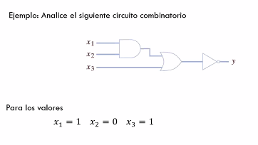

$$
    y = \lnot ((x_1 \land x_2) \lor x_3)
$$

Al entrar las primeras 2 señales, nos da como resultado falso ($1 \land 0 = 0$).
Y luego con la tercera nos queda verdadero ($0 \lor 1$ = 1). Luego la negamos
($\lnot 1 = 0$). Como resultado nos queda 0.

### Ejemplo 2

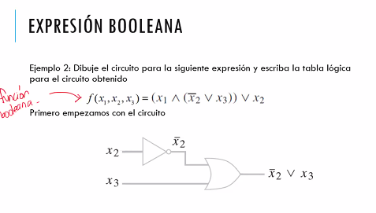

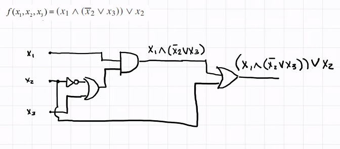

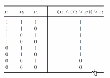

Mintermino
----------

Es un producto booleano en el que cada variable aparece solo una vez, y sus
operadores son: `AND` y `NOT`.

Maxitermino
-----------

Es una expresión booleana que se compone de variables y los operadores `OR`
y `NOT`.

Expresiones booleanas
---------------------

Una expresión lógica se puede representar de forma canónica usando minterminos
y maxiterminos.

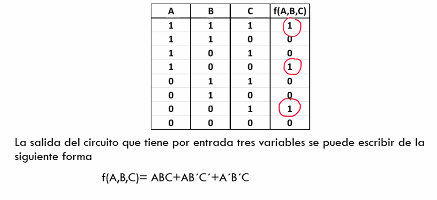

Diseno de Circuitos
===================

Ejercicio 1
-----------

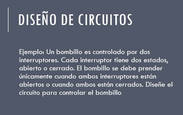

**Entrada:** El estado de los 2 interruptores

**Salida:** 1 si el bombillo debe prender, 0 si no

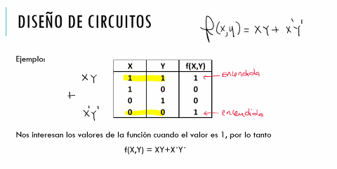

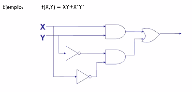

Ejercicio 2
-----------

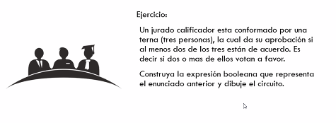

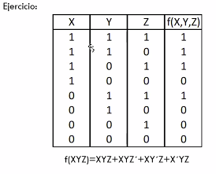

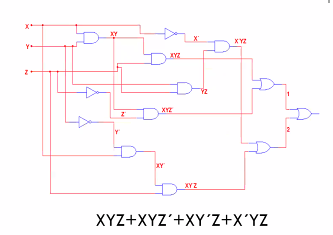
