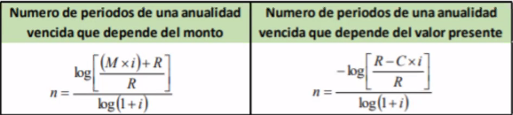

Anualidad simple y cierta
=========================

Es una serie de pagos que se realizan con cierta
periodicidad y en fechas especificas. Conocemos el valor, la fecha de inicio
y la de finalizaron.

Vencidas
========

Esperamos a que se cumpla el primer periodo para empezar a pagar.
Y el ultimo de los pagos coincide con el fin de al anualidad. Cada pago va
a generar intereses.

Monto de una anualidad vencida
------------------------------

> Una persona deposita Q 500 mensuales vencidos en una cuenta de ahorro que le
> paga un 9% de interés anual capitalizable mensualmente. Cuanto tendrá
> acumulado al final del pago 12?

Los pagos van:

1. $P_1 = 500(1+0.0075)^{11} = 542.83$
2. $P_2 = 500(1+0.0075)^{10} = 542.83$

Y sigue así.

Lo que podemos hacer es tratarlo como la sumatoria de una serie:

$$
M = R\left[\frac{(1+i)^n - 1}{i}\right]
$$

Donde:

* $M$ es el monto, o valor futuro
* $R$ es la renta, o pago periódico
* $i$ es la tasa de capitalización por periodo
* $n$ es el numero de periodos

Entonces nuestra solución es:

$$
M = 500\left[\frac{(1+0.0075)^{11} - 1}{0.0075}\right] = 6253.79
$$

### Ejemplo

> AL momento de nacer su hijo, Juan Manuel decide empezar un fondo de ahorro
> para sus estudios universitarios. Si empieza a pagar a un mes de nacido su
> hijo una cantidad de Q 100 mensuales en un banco que le paga el 8.5% de
> interés anual capitalizable mensualmente. Cuanto tendrá cuando su hijo cumpla
> 18 años?

Tenemos:

* $R = 100$
* $i = \frac{0.085}{12}$
* $n = 18 \times 12 = 216$

$$
M = 100\left[\frac{(1+\frac{0.085}{12})^{216} - 1}{\frac{0.085}{12}}\right]
= 50729.46
$$

Valor actual (Capital)
----------------------

$$
C = R\left[\frac{1 - (1 + i)^{-n}}{i}\right]
$$

### Ejemplo

> Una persona observa una una de los pagos mensuales para poder comprar un
> vehículo del año. La oferta indica que se harán 96 pagos mensuales de Q 3,000
> a una taza de interés anual de 6.5% capitalizable mensualmente. Cual es el
> valor de contado del vehículo?

El valor total lo encontramos fácilmente. $96 \times 3000 = 288000$.

$$
C = 3000\left[\frac{1 - (1 + \frac{0.065}{12})^{-96}}{\frac{0.065}{12}}\right] = 
224110.85
$$

Valor de la renta que depende del valor futuro
----------------------------------------------

> Una persona planea realizar un ahorro programado al fin de acumular Q 40,000
> al final de 3 años. Para el efecto depositara trimestralmente una cantidad en
> un banco que le paga el 15% anual capitalizable trimestralmente. Si los pagos
> son vencidos, cuanto tendrá que depositar cada trimestre?

$$
R = \frac{M \times i}{(1+i)^n - 1}
$$

$$
R = \frac{40000 \times \frac{0.15}{4}}{(1+\frac{0.15}{4})^{4 \times 3} - 1}
= 2700.49
$$

Numero de periodos
------------------

> Una persona tiene deudas con un banco de Q 60,000. El banco le ofrece
> consolidar sus deudas en un solo pago de 2,200 mensuales. Si el banco le
> cobra una tasa de 36% capitalizable mensualmente. Cuantos meses durara la
> deuda?

$$
n = \frac{-\log\left[\frac{R-C*i}{R}\right]}{\log(1+i)}
$$

$$
n = \frac{-\log\left[\frac{2200-60000*0.03}{2200}\right]}{\log(1+0.03)} = 57.67
$$

Anticipadas
===========

Lo único que hay que hacer el cambiar la formula

Tabla de amortización
=====================

Es la forma en la que se va a ir pagando la deuda.

> Una pareja planea comprar un amueblado de sala que cuesta Q 12,000 en 6 pagos
> a una taza del 18% anual capitalizable mensualmente. Construya la tabla de
> amortización.

* $C = 12000$
* $i = \frac{0.18}{12} = 0.015$

$$
R = \frac{C * i}{1 - (1 + i)^{-n}}
$$

$$
R = \frac{12000 * 0.015}{1 - (1 + 0.015)^{-6}} = 2106.30
$$

Son 6 pagos de $2106.30$

| No Pago | Pago    | Interés         | Amortización          | Saldo     |
|---------|---------|-----------------|-----------------------|-----------|
| 0       |         |                 |                       | 12,000    |
| 1       | 2106.30 | 12000*0.015=180 | 2106.30-180 = 1926.40 | 10,073.70 |
| 2       | 2106.30 | 151.11          | 1955.19               | 8,118.51  |
| 3       | 2106.30 | 121.78          | 1984.52               | 6,133.99  |
| 4       | 2106.30 | 92              | 2014.29               | 4,119.70  |
| 5       | 2106.30 | 61.80           | 2044.50               | 2075.20   |
| 6       | 2106.30 | 31.13           | 2075.17               | 0.02      |
