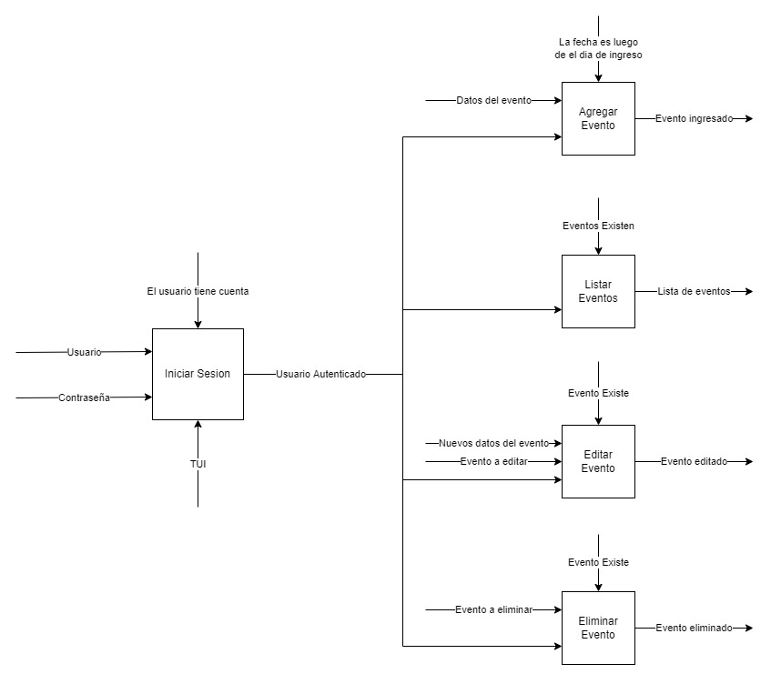
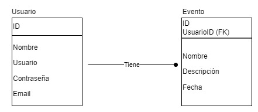

IDEF
====

Que es?
=======

IDEF (Definición Integrada) es una metodología gráfica de modelado de procesos
utilizada para implementar sistemas y software de ingeniería. Estos métodos se
utilizan en modelado funcional de datos, simulación, análisis orientado
a objetos y adquisición de conocimiento.

Características
---------------

* IDEF se puede utilizar en casi todos los contextos, industrias o áreas
  tecnológicas posibles.
* Los diagramas IDEF son fáciles de seguir y leer incluso sin conocimientos
  técnicos.
* IDEF muestra en detalle una metodología formal para nombrar procesos,
  diagramas y para proporcionar devoluciones.

Historia
--------

Durante los años 70 las fuerzas áreas de los Estados Unidos desarrollaron un
programa para la fabricación integrada asistida por computadora (ICAM). El
programa ICAM identificaba las necesidades de mejoras en las técnicas
y análisis de la comunicación para personal involucrado en la producción. El
resultado del proyecto ICAM es una serie de técnicas conocidas como IDEF
(Integrated Definition Methods). En la concepción inicial se incluían:

* `IDEF0`: Utilizado para la representación de actividades o procesos.
* `IDEF1`: Utilizado como modelo de representación y estructuración de la
  información.
* `IDEF2`: Utilizado para representar modelos que varían con el tiempo.

En 1983, las fuerzas aéreas de los Estados Unidos programaron un sistema
integrado de ayuda de la información basado en `IDEF1`, creando el `IDEF1X` (`IDEF1`
ampliado).

Con el devenir de los años y la utilización de estas técnicas, `IDEF` siguió su
desarrollo y nuevas versiones aparecieron: `IDcF3`, `IDEF4` e `IDEF5`. Actualmente
existen varias herramientas que facilitan la modelación con estas técnicas.

Comparación con RUP
-------------------

RUP modela usando UML, y IDEF utilizando los diagramas `IDEF0`, `IDEF1`, etc.[^1]

[^1]: Las comparaciones están basadas en el documento: "*AN ONTOLOGY-BASED
COMPARATIVE STUDY OF UML AND IDEF INVIEW OF BUSINESS MODELLING*", Ovidiu Noran,
Griffith University.
[**Link**](https://www.academia.edu/22201964/UML_vs_IDEF_An_Ontology_Oriented_Comparative_Study_in_View_of_Business_Modelling)

### Visualización de los datos

| Diagrama   | Ventajas                | Desventajas                       |
|------------|-------------------------|-----------------------------------|
| IDEF1      | Impulsado por los datos | Mezcla conceptual y relacional    |
| IDEF4      | Expresivo para OO y ER  | La relacion con IDEF1 no es clara |
| UML Clases | Expresivo para OO y DB  | Junta los datos con las funciones |

### Funcionalidades

| Diagrama         | Ventajas         | Desventajas                   |
|------------------|------------------|-------------------------------|
| IDEF0            | Descomponible    | La notacion puede ser confusa |
| UML Casos de Uso | Baja complejidad | Es poco expresivo             |

### Comportamiento

| Diagrama         | Ventajas               | Desventajas                 |
|------------------|------------------------|-----------------------------|
| IDEF3 PFD        | Descomponible          | Hibrido                     |
| UML Actividad    | Tiene roles            | Potencialmente confuso      |
| IDEF4            | Expresivo para metodos | Potencialmente confuso      |
| UML Colaboración | Condiciones, Loops     | Complejo para casos grandes |
| UML Estado       | Variables, Triggers    | Complejo para casos grandes |

Ejemplo
=======

El ejemplo esta basado en el proyecto que se coloco en la actividad 1.

Fase 1: Análisis
----------------

Un usuario autenticado podrá crear, listar, editar, y eliminar sus propios
eventos.

### Necesidades

El usuario tendrá que tener eventos para gestionar con la app.

### Especificaciones

Solo los usuarios autenticados podrán gestionar eventos.

De los eventos se tiene que guardar:

* ID
* Nombre
* Descripción
* Fecha

De los usuarios se tiene que guardar:

* Nombre de usuario
* Nombre completo
* Contraseña

Fase 2: Diseño
--------------

