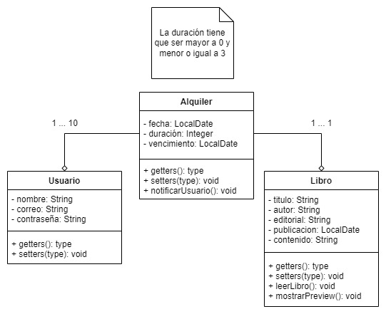

Proyecto 1 - Despertador
========================

Fase 1: Análisis
----------------

### Ámbito

#### Ámbito del proyecto

Es una aplicación de teléfono que gestionara las alarmas del usuario.

#### Recursos

* Android Estudio
* Linux
* Desarrollador

### Requisitos del software

#### Especificaciones pre-eliminares

El usuario podrá programar sus alarmas, y elegir los tonos que sonaran con las
alarmas.

#### Necesidades

El usuario necesita tener un teléfono donde correr el software, y alarmas para
programar.

#### Especificaciones

La aplicación se llamara "Despertador KS".

De las alarmas se guardara:

* Hora
* Días en los que sonara
* Sonido para la alarma

Se tiene que guardar un registro de las alarmas programadas en una base de
datos.

#### Tiempo estimado de desarrollo

1 hora y 30 minutos

### Requisitos del hardware

* Arquitectura de CPU x86_64; procesador Intel Core de segunda generación
  o posterior, o procesador AMD compatible con AMD Virtualization (AMD-V)
  y SSSE3
* 8 GB de RAM o más
* 8 GB de espacio disponible en el disco como mínimo (IDE + SDK de Android
  _ Android Emulator)

Fase 2: Diseño
--------------

### Casos de uso

### Clases

Proyecto 2 - Reservación
========================

Fase 1: Análisis
----------------

### Ámbito

#### Ámbito del proyecto

Es una aplicación de ordenador que permitirá gestionar las reservaciones de un
restaurante.

#### Recursos

* IDE
* Java SDK
* Linux
* Desarrollador

### Requisitos del software

#### Especificaciones pre-eliminares

Se tiene que tener una lista de todas las mesas, indicando cuando están
disponibles. Se tiene que permitir al usuario hacer una reservación, y se le
tiene que notificar al usuario por correo.

#### Especificaciones

El flujo de trabajo es el siguiente:

1. Se muestran los lugares disponibles al usuario
2. El usuario selecciona un lugar, e indica el tiempo y fecha en que lo ocupara
3. El lugar se remueve de los lugares disponibles
4. Se muestra nuevamente el listado
5. Se le notifica al correo del usuario la fecha de vencimiento y la fecha en
   la que solicito la mesa.

De los lugares tiene que guardarse:

* ID
* Ubicación

Y de las reservaciones tiene que guardarse:

* ID
* Lugar reservado
* Fecha y hora de la reserva
* Fecha de vencimiento
* Correo del solicitante

#### Tiempo estimado de desarrollo

2 horas.

### Requisitos del hardware

* **Procesador:** Se requiere como mínimo un Pentium 2 266 MHz.
* **Espacio en Disco:** Se requieren como mínimo 500mb de espacio libre en el
  disco. (Contando la instalación de java y sus runtimes, junto con el programa
  en si).
* **Memoria:** Se requiere como mínimo 128mb de memoria RAM.

Fase 2: Diseño
--------------

### Casos de uso

### Clases

Proyecto 3 - Biblioteca
=======================

Fase 1: Análisis
----------------

### Ámbito

#### Ámbito del proyecto

Es una aplicación de escritorio que permitirá suscribirse a una biblioteca
virtual.

#### Recursos

* IDE
* Java SDK
* Linux
* Desarrollador

### Requisitos del software

#### Especificaciones pre-eliminares

Se le muestran libros disponibles al usuario, permitiendole rentar hasta
cierta cantidad.

#### Especificaciones

El flujo de trabajo es el siguiente:

1. Se le muestran al usuario los libros disponibles.
2. El usuario es capaz de pre visualizar los libros.
3. El usuario puede alquilar libros para leerlos.
4. Se le notifica por correo al usuario la fecha en la que alquilo el libro,
   y la fecha de vencimiento del alquiler.

**Restricciones:**

* El usuario puede tener hasta 10 libros.
* Los alquileres pueden durar como máximo 3 días.

#### Tiempo estimado de desarrollo

3 Horas

### Requisitos del hardware

* **Procesador:** Se requiere como mínimo un Pentium 2 266 MHz.
* **Espacio en Disco:** Se requieren como mínimo 500mb de espacio libre en el
  disco. (Contando la instalación de java y sus runtimes, junto con el programa
  en si).
* **Memoria:** Se requiere como mínimo 128mb de memoria RAM.

Fase 2: Diseño
--------------

### Casos de uso

### Clases

