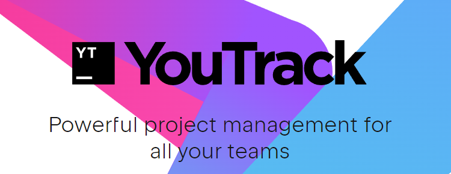
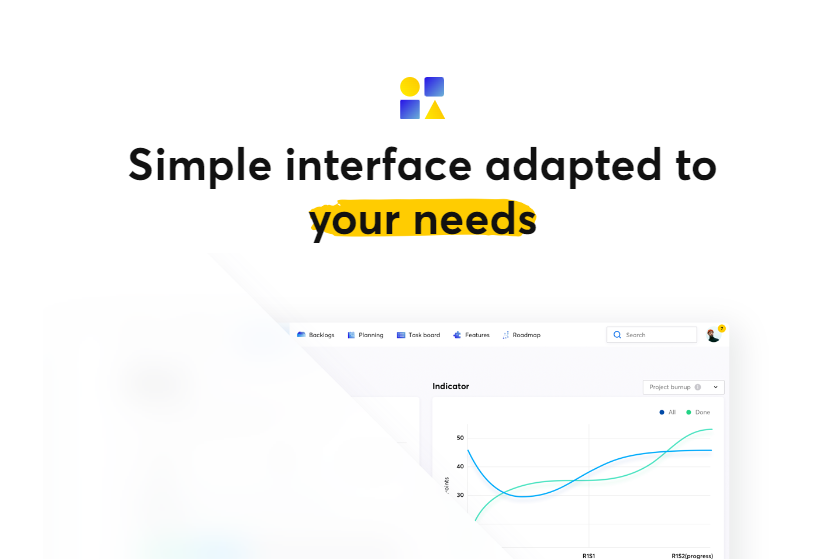
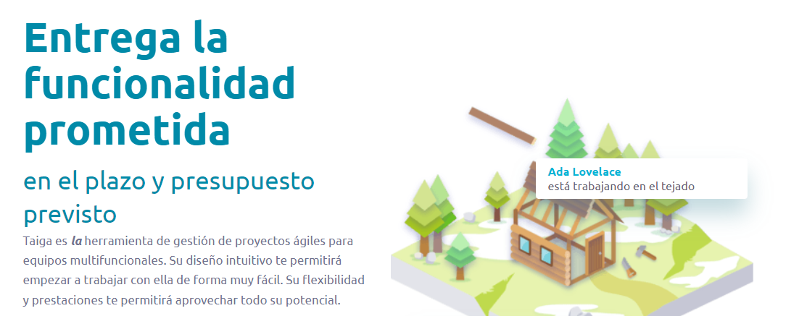

Origen
======

Este modelo fue identificado y definido por Ikujiro Nonaka y Takeuchi
a principios de los 80, al analizar cómo desarrollaban los nuevos productos las
principales empresas de manufactura tecnológica.

En 1995, Ken Schwaber presentó “Scrum Development Process” en OOPSLA 95
(Object-Oriented Programming Systems & Applications conference)(SCRUM
Development Process), un marco de reglas para desarrollo de software, basado en
los principios de Scrum, y que él había empleado en el desarrollo de Delphi,
y Jeff Sutherland en su empresa Easel Corporation

A que se debe su nombre
-----------------------

En su estudio, Nonaka y Takeuchi compararon la nueva forma de trabajo en
equipo, con el avance en formación de melé (scrum en inglés) de los jugadores
de Rugby, a raíz de lo cual quedó acuñado el término “scrum” para referirse
a ella.

Ventajas y Desventajas
======================

| Ventajas                             | Desventajas                              |
|--------------------------------------|------------------------------------------|
| Mejora la cooperacion                | Solo funciona con equipos reducidos      |
| Mejora la productividad              | Requiere de una definicion exhaustiva    |
| Da un enfoque democratico al trabajo | Require de una alta formacion            |
| Los equipos trabajan mejor           | Es dificil escalarlo a proyectos grandes |

Herramientas para trabajar con SCRUM
====================================

JetBrains YouTrack
------------------

* Ventajas: Todas las funcionalidades están disponibles para todos los tipos de
  licencias.
* Desventajas: Gratuito solo hasta 10 usuarios

Icescrum
--------

* Ventajas: Es una solución de código abierto gratuita para equipos de
  cualquier tamaño.
* Desventajas: La versión en la nube cuesta 35\$.

Taiga
-----

* Ventajas: Ganadora del premio a la mejor herramienta ágil en el 2015.
  Gratuita para todos los proyectos públicos.
* Desventajas: Los proyectos privados cuestan hasta 19\$ al mes.
