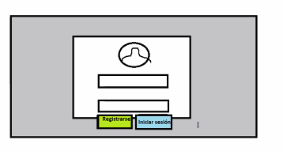
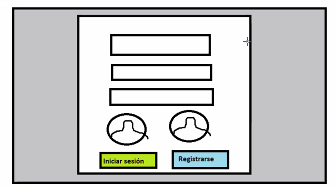
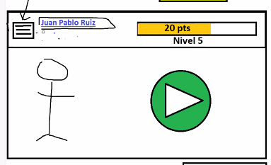
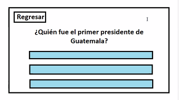
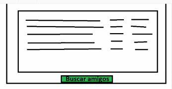
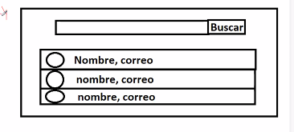
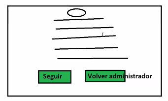

<!--
Paginas:

* ~Inicio de sesión
* ~Registro
* ~Dashboard
* ~Preguntas
* ~Mi perfil
* ~Buscar usuarios
* ~Ver información de usuario
* ~Ranking de amigos
* ~Ranking de administradores (Global)
* ~Pantalla de configuracion para admins
-->

Inicio de sesión
================

Registro
========

Dashboard
=========

Preguntas
=========

**Nota:** Con el mismo header que el dashboard, igual que las otras paginas.

Ranking amigos
===============

El de administrador tiene que permitir buscar por usuario

Buscar usuarios
===============

La tabla se pude expandir para mostrar la informacion del usuario.

