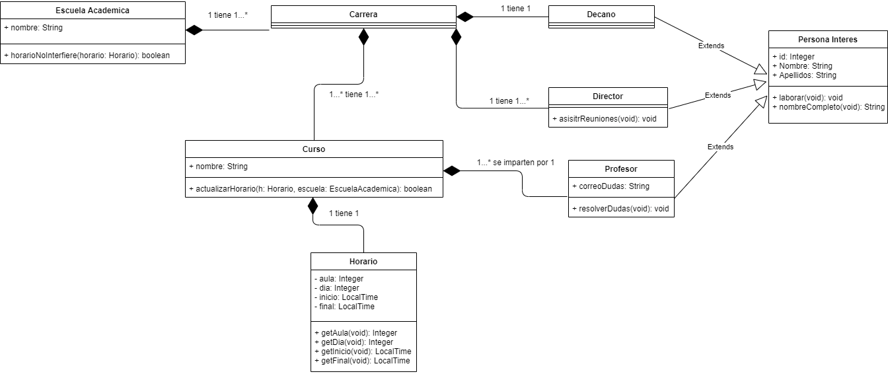
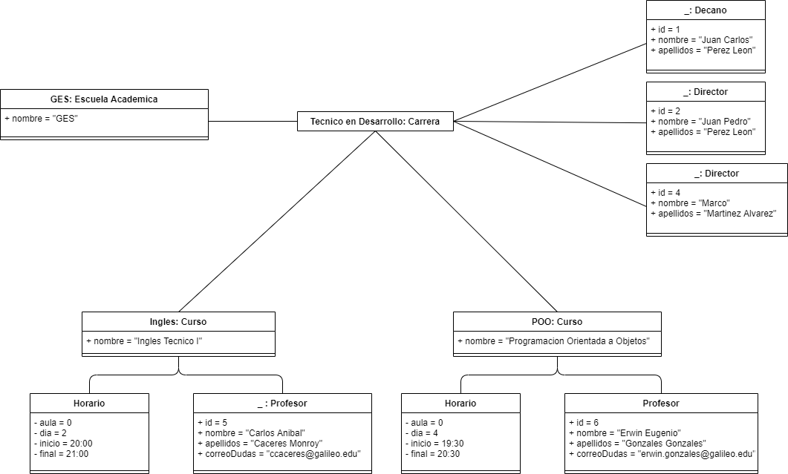

Análisis
========

Explicación del problema
------------------------

Se tiene que crear un sistema para la gestión de carreras y cursos. El problema
es modelar los objetos involucrados en la gestión de cursos, con sus
respectivos atributos y métodos, y las relaciones que tendrán entre ellos. Este
sistema de gestión tiene que permitir agregar, modificar y eliminar cualquiera
de los objetos involucrados.

Solución propuesta
------------------

Se tendrá un objeto `EscuelaAcademica` que guardara objetos de tipo `Carrera`.

Cada `Carrera` tendrá guardados objetos de tipo `Curso` para indicar los cursos
que están disponibles, un objeto tipo `Decano` y una lista de objetos tipo
`Director` (ambos hijos de `PersonaInteres`).

Cada `Curso` tiene un objeto `Profesor` (hijo de `PersonaInteres`), y un
`Horario` en el que se imparte.

Definición de Clases
--------------------

---

### Escuela Académica

**Descripción:**

> El departamento de estudios que organiza las diferentes carreras

**Atributos:**

* **Carreras:** Un `ArrayList` que contiene objetos de tipo `Carrera` (Publico)
* **Nombre:** Un `String` que contiene el nombre de la escuela (Publico)

**Métodos:**

* `horarioNoInterfiere`

**Relaciones:**

* Una `EscuelaAcademica` contiene múltiples `Carrera`s.

---

### Carrera

**Descripción:**

> Contiene una serie de cursos y el personal administrativo que se encarga de
> los mismos

**Atributos:**

* **Cursos:** Un `ArrayList` que contiene objetos de tipo `Curso` (Publico)
* **Decano:** Un objeto tipo `Decano` (Publico)
* **Directores:** Un `ArrayList` que contiene objetos tipo `Director` (Publico)

**Métodos:**

Ya que los atributos son públicos, esta clase no necesita métodos para
interactuar con ellos.

**Relaciones:**

* Una `Carrera` contiene múltiples `Cursos`
* Una `Carrera` contiene múltiples `Directores`
* Una `Carrera` contiene un `Decano`
* Una `Carrera` pertenece a una `EscuelaAcademica`

---

### Curso

**Descripción:**

> Es una clase que se imparte a una serie de estudiantes.

**Atributos:**

* **Profesor:** Un objeto tipo `Profesor` que imparte el curso (Publico)
* **Horario:** Un objeto tipo `Horario` que indica cuando se imparten las
  clases (Privado)
* **Nombre:** Un `String` (Publico)

**Métodos:**

* `actualizarHorario`

**Relaciones:**

* Un `Curso` tiene un `Profesor`
* Un `Curso` tiene un `Horario`
* Un `Curso` tiene varios `Estudiante`s
* Un `Curso` pude pertenecer a múltiples `Carrera`s

---

### Horario

**Descripción:**

> Una clase inmutable que indica en que momento se estará utilizando cierta
> aula.

**Atributos:**

* **Aula:** Un entero indicando el numero de aula que se usara (Privado)
* **Día:** Un entero indicando el día de la semana en la que se usara (Privado)
* **Inicio:** Un `LocalTime` indicando la hora a la que empezara la clase (Privado)
* **Final:** Un `LocalTime` indicando la hora a la que terminara la clase (Privado)

**Métodos:**

* `getAula`
* `getDia`
* `getInicio`
* `getFinal`

**Relaciones:**

* Un `Horario` esta relacionado a un `Curso`

---

### Persona de Interés

**Descripción:**

> Es algún empleado de importancia para la carrera

**Atributos:**

* **Id:** Un entero que sirve como numero de identificación (Publico)
* **Nombre:** Un `String` que contiene los nombres de el empleado (Publico)
* **Apellidos:** Un `String` que contiene los apellidos de el empleado (Publico)

**Métodos:**

* `laborar`
* `nombreCompleto`

---

### Decano

**Descripción:**

> Empleado que preside una `Carrera`. Hereda de `PersonaInteres`.

**Atributos:**

Únicamente tiene los atributos heredados de `PersonaInteres`.

**Métodos:**

Únicamente tiene los métodos heredados de `PersonaInteres`.

**Relaciones:**

* Un `Decano` preside sobre una `Carrera`

---

### Director

**Descripción:**

> Empleado que forma parte de el personal administrativo de una `Carrera`.
> Hereda de `PersonaInteres`.

**Atributos:**

Únicamente tiene los atributos heredados de `PersonaInteres`.

**Métodos:**

Ademas de los métodos heredados de `PersonaInteres`.

* `asistirReuniones`

**Relaciones:**

* Múltiples `Director`es se encargan de una `Carrera`

---

### Profesor

**Descripción:**

> Es el empleado encargado de impartir un curso. Hereda de `PersonaInteres`.

**Atributos:**

* **Correo para dudas:** Un `String`

**Métodos:**

* `resolverDudas`

**Relaciones:**

* Un profesor imparte múltiples `Cursos`

Diagramas
=========

Diagrama de clases
------------------

Diagrama de Objetos
-------------------

Descripción de los métodos
==========================

Métodos de Escuela Académica
----------------------------

### `horarioNoInterfiere`

**Parámetros:**

* horario

**Valor de retorno:** Verdadero si el horario no interfiere con ningún otro orario

**Procedimiento:**

> En cada curso de cada carrera que contiene la escuela realizamos lo
> siguiente:
>
> Verificamos si tienen la misma aula. Si no la tienen continuamos al siguiente
> curso.
>
> Si tienen la misma aula, verificamos que los horarios no interfieran uno con
> el otro. Si los horarios se interfieren, retornamos falso.
>
> Si pasamos por todos los cursos y ningún horario interfiere, retornamos
> verdadero.

Métodos de Curso
----------------

### `actualizarHorario`

**Parámetros:**

* horario: El horario que se le quiere colocar al curso
* escuela: La escuela a la que pertenece el curso

**Valor de retorno:** Verdadero si se pudo actualizar el horario

**Procedimiento:**

> Se verifica que el horario que se entrego no interfiera con ningún otro
> horario en la escuela, (usando el método `horarioNoInterfiere` de
> `EscuelaAcademica`). Si el horario no interfiere con ningún otro, se cambia
> el horario del curso y se retorna verdadero. De otro modo se retorna falso.

Métodos de Horario
------------------

### `getAula`

**Valor de retorno:** El aula reservada por ese horario.

### `getDia`

**Valor de retorno:** El día reservado por ese horario.

### `getInicio`

**Valor de retorno:** A que horas inicia la clase

### `getFinal`

**Valor de retorno:** A que horas finaliza la clase

Métodos de Persona Interés
--------------------------

### `laborar`

**Parámetros:** Ninguno

**Valor de retorno:** Ninguno

**Procedimiento:**

> Imprime por pantalla: `nombreCompleto() + " esta trabajando"`

### `nombreCompleto`

**Parámetros:** Ninguno

**Valor de retorno:** Un `String` con el nombre completo de la persona.

**Procedimiento:**

> Suma `nombre` y `apellidos`, y luego retorna el resultado.

Métodos de Director
-------------------

### `asistirReuniones`

**Parámetros:** Ninguno

**Valor de retorno:** Ninguno

**Procedimiento:**

> Imprime por pantalla: `nombreCompleto() + " va a asistir a sus reuniones
> designadas"`

Métodos de Profesor
-------------------

### `resolverDudas`

**Parámetros:** Ninguno

**Valor de retorno:** Ninguno

**Procedimiento:**

> Imprime por pantalla: `nombreCompleto() + " va ayudar a sus estudiantes
> a entender los temas"`
