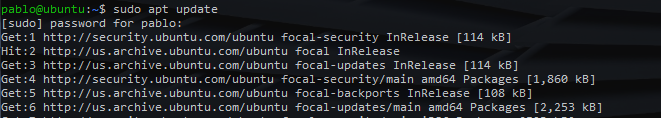
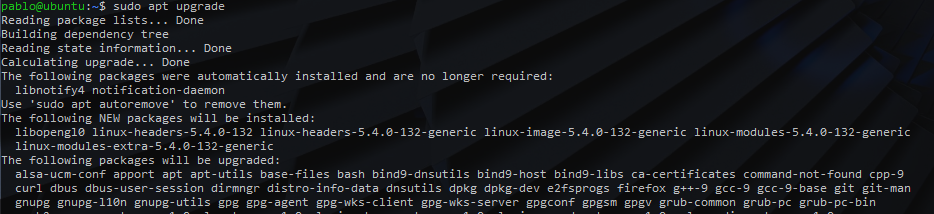
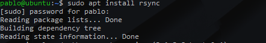
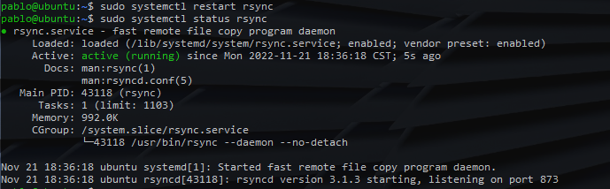

Cómo proteger, mitigar o recuperar el sistema?
==============================================

El ataque descrito en la actividad 1 fue: **Wannacry**

Se hubieran podido utilizar 2 de las estrategias mencionadas:

Parches de seguridad
--------------------

Según la linea de tiempo del exploit Eternal Blue[^1]:

[^1]: Tomada de la pagina de la wikipedia de [**Eternal
    Blue**](https://es.wikipedia.org/wiki/EternalBlue).

* El exploit fue parchado el 14 de marzo a través del parche de seguridad
  `MS17-010`
* El exploit se filtro el 14 de abril por el grupo de hackers "The Shadow
  Brokers".
* El exploit se utilizo para el ataque Wannacry el 12 de mayo.

Microsoft parcho la vulnerabilidad un mes entero antes de que se filtrara,
y casi 2 meses antes de que fuera utilizada. Si los usuarios y las empresas
hubieran mantenido sus sistemas al día con todos los parches de seguridad
hubieran estado protegidos frente al ataque de Wannacry.

Copias de seguridad
-------------------

De haber hecho copias de seguridad constantes, las perdidas por el ataque de
Wannacry hubieran sido mínimas. Simplemente hubieran tendí que restaurar el
ordenador completo desde la copia de seguridad, o hubieran tenido que instalar
un sistema nuevo y únicamente restaurar los archivos.

Implementación de herramienta gratuita
======================================

Instalaremos la aplicación `rsync` en Ubuntu 20.04.5

Previo a la instalación
-----------------------

Iniciamos actualizando el dispositivo. Utilizamos el comando `apt update` para
obtener la lista de paquetes mas reciente:



Y luego utilizamos el comando `apt upgrade` para actualizar los paquetes que
tengamos en nuestro ordenador:



Instalación
-----------

Ubuntu tendría que tener `rsync` instalado por default. Pero en caso de que no
este instalado se puede instalar con el comando `apt install rsync`.



Configuración
-------------

### Habilitar el servicio

Para correr `rsync` como un servicio tenemos que hacer 2 cosas:

1. Crear el archivo de configuración `/etc/rsyncd.conf`
2. Copiar el archivo `/lib/systemd/system/rsync.service`
   a `/etc/systemd/system/rsync.service`


Luego únicamente hay que reiniciar el servicio.



### `rsyncd.conf`

Podemos crear el archivo de configuración tomando como base el siguiente
template:

```ini
# Global configuration of the rsync service
pid file = /var/run/rsyncd.pid

# Username and group for working with backups
uid = backup-user
gid = backup-user

# Don't allow to modify the source files
read only = yes

# Data source information
[data]
path = /path/to/backup
list = yes
auth users = backup-user
secrets file = /etc/rsyncd.passwd
```

### Autenticación entre ordenadores

Tenemos que crear un archivo en `/etc/rsyncd.passwd` con permisos `0600`. Este
tiene que contener lo siguiente:

```
backup-user:password
```

Donde:

* `backup-user`: Es el mismo que asignamos en el archivo de configuración.
* `password` Es la contraseña que vamos a utilizar.

En el servidor que recibirá los archivos tenemos que colocar el mismo archivo
pero sin el campo `backup-user`.

Realización del backup
----------------------

Para realizar el backup correremos `rsync` con los siguientes parámetros:

* `-a`: Para correrlo en "archive mode"
* `--password-file=/etc/rsyncd.passwd`: Para indicarle de donde tomar al
  contraseña
* `backup-user@server-ip::data`: Donde
    * `backup-user`: Es el usuario que asignamos en el archivo de configuración
    * `server-ip`: Es la dirección ip del servidor que recibirá el backup
* `/destination/path`: La ubicación donde queremos hacer el backup. Seria
  recomendable agregar la fecha a el path.

Referencias
===========

* Wikipedia EternalBlue: <https://es.wikipedia.org/wiki/EternalBlue>
* Server Space, How to Use Rsync to Create a Backup on Ubuntu 20.04:
  <https://serverspace.io/support/help/use-rsync-to-create-a-backup-on-ubuntu/>
